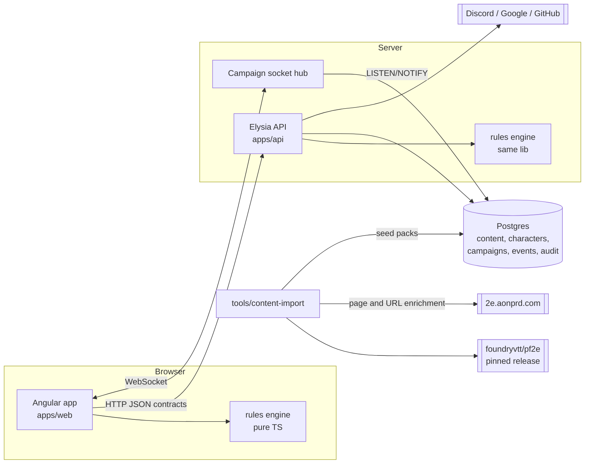

# Pioneer architecture

Pioneer is a Pathfinder Second Edition (remaster) character manager: builder, sheet, play aid and campaign
companion. It is not a virtual tabletop. Everything is text; there are no images.

This folder is the architecture. Decisions with real alternatives are recorded as ADRs in [`../adr`](../adr), and
the delivery plan is in [`../roadmap.md`](../roadmap.md).

| Document                                       | Covers                                                                 |
| ---------------------------------------------- | ---------------------------------------------------------------------- |
| [rules-engine.md](rules-engine.md)             | Statistics, modifiers, stacking, rule elements, predicates, provenance |
| [content-model.md](content-model.md)           | Content kinds, books and source references, packs, Foundry import      |
| [character-model.md](character-model.md)       | Build choices, inventory, play state, overrides, persistence           |
| [play-and-campaigns.md](play-and-campaigns.md) | Actions, conditions, dice, campaigns, live sync, interop               |

## Pillars

1. **Fully generic.** The engine knows the _shape_ of PF2e (checks, DCs, proficiency, typed bonuses, degrees of
   success), not its content. Every number a character has comes from content, and every piece of content can be
   replaced or extended by homebrew. Official books are just content packs that happen to be published by Paizo;
   they use exactly the same path homebrew does.
2. **Everything is sourced.** Every content entry carries at least one source reference: a book and page, an
   Archives of Nethys URL, or both. Homebrew carries its author. The UI can always answer "where does this come from?".
3. **Everything is explainable.** No derived value is stored. Every derived value is computed by a pure engine that
   also returns _why_: the stack of modifiers that applied, the ones that were suppressed by stacking rules, the
   ones that only apply in some situations, and any manual overrides, each traced back to the item, feat, condition
   or person that caused it.
4. **Situational, not just static.** Modifiers that depend on the situation ("+2 to initiative when rolling
   Stealth", "+1 to Seek in forests") are shown as conditional adjustments on the sheet and resolved when you roll.
5. **Mechanics before breadth.** Build every system against the remastered core rules first (Player Core as the
   dogfood dataset), then widen content.

## System context



- **One engine, two hosts.** `libs/rules/engine` is pure TypeScript with no I/O. The browser runs it for instant
  feedback while building; the server runs it for validation, campaign views and exports. Same inputs, same output.
- **Content lives in the database.** Official packs are generated by the importer, committed as JSON, and seeded on
  deploy. Homebrew packs are created in the app. Both are rows in the same tables and load through the same registry.
- **Characters store decisions, not results.** A character is its choices, inventory, play state and overrides.
  The sheet is a function of that plus the loaded content.

## Library layout

The existing Nx layering stays: `domain` (pure model, no framework), `application` (use cases, ports),
`infrastructure` (Drizzle, Elysia), `feature` (Angular). New libraries:

```text
libs/
  rules/
    sdk/            content schemas, rule element schemas, source refs, predicates (exists, grows)
    engine/         derivation pipeline, statistics, breakdowns, action availability
    dice/           dice expressions, RNG port, degree of success, damage application
    formula/        formula grammar: parser to a positioned tree, printer, references (kernel only)
    catalog/        pack loaders (exists; switches from TS imports to API/DB loading)
  content/          (TS packs retired; replaced by content/ JSON data, see content-model.md)
  character/        domain, application, infrastructure, feature (exists)
  campaign/         domain, application, infrastructure, feature
  homebrew/         authoring use cases and editor UI
  identity/         domain, application, infrastructure, data-access, feature (exists): accounts, OAuth
                    sessions, request authentication (ADR-0007, ADR-0010)
  interop/
    foundry/        Foundry pf2e actor export, rule element translation (shared with importer)
    pathbuilder/    Pathbuilder JSON import
  shared/           kernel, server, web (exists)
  frontier/         design system (exists, text-only components, logical CSS for RTL)
  shared/i18n/      locale resolution, message loading by scope, ICU formatting, unit display
content/
  books.json        book registry
  packs/<pack>/     generated JSON per content kind
tools/
  content-import/   Foundry pf2e -> Pioneer translator, coverage report, AoN enrichment
```

Dependency rule: `rules/*` depends only on `shared/kernel` and other `rules/*` libraries: `rules/formula` on the kernel
alone, `rules/sdk` on `rules/formula`, and `dice`, `engine` and `catalog` on `rules/sdk`. Feature areas depend on
`rules/*`, never the reverse.
Content data never imports code.

## Cross-cutting

- **Validation at boundaries.** Zod schemas (already the house style) for every wire shape, content entry, rule
  element and stored document. Stored JSON documents carry a `schemaVersion` and are migrated on read.
- **Audit.** The existing `audit.log` trigger covers every table holding user data. Campaign events are their own
  append-only log on top of that.
- **Licensing.** Remaster mechanics and rules text are ORC; Paizo IP outside ORC falls under the Community Use
  Policy. All official content is derived from the Foundry pf2e system; a public Legal page (footer link) states
  this, carries the Paizo and ORC notices, and offers the content caches for download. See
  [`../../NOTICE.md`](../../NOTICE.md) and [ADR-0003](../adr/0003-content-as-data-imported-from-foundry.md).
- **Internationalisation.** Runtime locale switching with ICU messages and `Intl`. No user-facing strings in code;
  the engine returns message descriptors. UI messages load per route scope; content ships locale-free mechanics
  bundles plus per-locale name and sharded description bundles, prefetched when idle. See
  [ADR-0009](../adr/0009-i18n-and-lazy-loading.md).
- **Deployment.** The API compiles to one `pioneer-api` binary (`nx build api`; `-c linux-x64` or `-c linux-arm64`
  to cross-compile, host platform otherwise). It serves the built web app from `WEB_DIST` on the same origin.
  Migrations ship beside it, not inside it: set `MIGRATIONS_DIR` to their folder, since the repo-relative default
  points into the binary's virtual FS. The server migrates on start under an advisory lock, so instances starting
  together take turns. To migrate as a separate deploy step, set `MIGRATE_ON_START=false` and run
  `pioneer-api migrate`. See [ADR-0011](../adr/0011-api-binary-and-migrations.md).
- **Testing.** Property tests for the engine and dice (fast-check, already in use). Golden tests: Paizo pregenerated
  characters imported and compared against their published numbers. Importer coverage reports gate content PRs.
