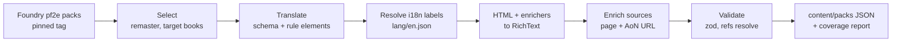

# Content model

Content is everything the rules define: traits, statistics, conditions, actions, ancestries, heritages,
backgrounds, classes and their features, feats, spells, equipment, runes, deities, languages, creatures. It is data
in the database, never code.

## Content entry

Every entry, of every kind, shares one envelope. Kind-specific data hangs off it with its own zod schema.

```ts
interface ContentEntry<K extends ContentKind> {
  id: ContentId; // UUIDv5 of `<pack>/<slug>` (existing scheme, unchanged)
  pack: PackId;
  kind: K;
  slug: Slug; // permanent once published
  name: string;
  level?: number; // 0 to 30; a creature always has one, from -1 to 25
  rarity: 'common' | 'uncommon' | 'rare' | 'unique';
  traits: readonly TraitSlug[];
  sources: readonly SourceRef[]; // at least one, see below
  description: RichText; // ORC rules text for official content, author text for homebrew
  rules: readonly RuleElement[];
  display?: DisplayHints; // e.g. feat display category override, see play-and-campaigns.md
  externalIds?: { foundry?: string; aon?: AonUrl; pathbuilder?: string };
  supersedes?: readonly ContentId[]; // remaster entry replacing a legacy one
  data: KindData[K];
}
```

`ContentEntry` in `libs/rules/sdk` (`content-entry.ts`) is this envelope as a zod schema. `kind` picks the `data`
schema from a kind registry (`KIND_DATA`, `kind-data.ts`); a kind with no schema yet is an error naming it. On top
of the field schemas it checks that `id` is UUIDv5 of `<pack>/<slug>`, that there is at least one source, that
traits are unique, and that `supersedes` never holds the entry's own id. The rules playground's "Content entry"
mode loads an example per registered kind. Until Epic 2.3 replaces `libs/content/*`, packs keep their older shape
and the registry wraps their definitions in `PackEntry`.

### Kinds

| Group      | Kinds                                                                                           |
| ---------- | ----------------------------------------------------------------------------------------------- |
| Rules core | `statistic`, `trait`, `condition`, `action`, `damage-type`, `sense`, `language`, `variant-rule` |
| Build      | `ancestry`, `heritage`, `background`, `class`, `class-feature`, `feat`, `archetype`, `deity`    |
| Magic      | `spell` (incl. focus spells and cantrips), `ritual`, `spellcasting-tradition`                   |
| Equipment  | `weapon`, `armor`, `shield`, `equipment`, `consumable`, `rune`, `treasure`, `kit`               |
| Play       | `effect` (spell and feat effects, GM effects)                                                   |
| Bestiary   | `creature`, `hazard` (later milestone)                                                          |

Class progression (features by level, feat slots, skill increases, boosts) is data on the `class` entry, expressed
as `GrantItem` and slot-granting rule elements keyed by level. The builder's choice slots fall out of the engine;
nothing about level 1 to 20 is hard-coded.

Statistics are content too: a `statistic` entry names a selector, its domains, an actor-only base formula, and
whether it is a check or a DC (see [rules-engine.md](rules-engine.md#statistics-are-content)).

#### Rules core data

Each kind's `data` follows what Foundry pf2e stores for it, in Pioneer's words. What an entry does to statistics is
in its `rules`, not repeated in `data`; a condition's `implies` is the one exception, below. Schemas live in
`libs/rules/sdk`, registered in `kind-data.ts`.

| Kind           | `data`                                                                                                  |
| -------------- | ------------------------------------------------------------------------------------------------------- |
| `condition`    | `valued`; `group?`, Foundry's sheet grouping, which says nothing about stacking; `overrides`; `implies` |
| `action`       | `cost?`; `category?`; `requirements?` and `trigger?` as rich text; `frequency?`; `selfEffect?`          |
| `damage-type`  | none yet; a type's group stays in `DAMAGE_GROUP_TYPES`, as Foundry keeps it in code                     |
| `sense`        | `acuity?`, the acuity the sense always has; `unlimitedRange?` (darkvision)                              |
| `trait`        | `appliesTo`: each kind that carries it once, from the Foundry trait list it sits in                     |
| `language`     | none yet; rarity is the envelope's                                                                      |
| `variant-rule` | none yet; what it changes is in `rules`, applied to every character in a campaign that enables it       |

- `condition`: `valued` says whether it takes a value (Frightened 2) or not (Blinded). `group` is one of
  `abilities`, `attitudes`, `death`, `detection`, `senses`. `overrides` lists the conditions it replaces
  (Blinded overrides Dazzled), and is how conditions exclude each other. `overrides` and `implies` are `ContentId[]`.
- `action`: `cost` is an `action-cost` glyph, absent for a passive ability. `frequency` is `max` uses `per` turn,
  round, minute, ten minutes, hour, 24 hours, day, week, month or year. `selfEffect` is the effect it applies to
  the user, by `ContentId`.

Two checks span fields: a reaction needs a `trigger`, and every condition in `implies` needs a `GrantItem` of it in
`rules` with no predicate. Foundry applies implied conditions (Grabbed's Off-Guard and Immobilized) with
`GrantItem`, and so does the engine; `implies` is the list the sheet shows. The check runs one way: a condition may
grant more than it lists.

#### Build data

The same rule holds for build kinds: `data` is what Foundry pf2e stores, less what rule elements already express.
Lists of attributes, slugs and ids name each item once.

| Kind            | `data`                                                                                                      |
| --------------- | ----------------------------------------------------------------------------------------------------------- |
| `ancestry`      | `hitPoints`, `size`, `speed`, `reach`; `boosts`; `flaws`; `languages`; `additionalLanguages`; `vision?`     |
| `heritage`      | `ancestry?`, absent for a versatile heritage                                                                |
| `background`    | `boosts`; trained skills and lore are `Proficiency` elements, its skill feat a `GrantItem`                  |
| `class`         | `keyAttribute`, the attributes it may be; `hitPoints` per level; `additionalSkills`; progression in `rules` |
| `class-feature` | `action?`; always has a `level`                                                                             |
| `feat`          | `category`; `prerequisites?` as rich text; `onlyLevel1?`; `maxTakable?`; `action?`; always has a `level`    |
| `archetype`     | `dedication`; `multiclass?`, the class it is the multiclass archetype of                                    |
| `deity`         | `category`; `sanctification?`; `domains`; `font`; `attributes`; `skills`; `weapons`; `spells`               |

- **Boosts.** A boost is the attributes it may go to: one for a fixed boost, all six for a free one. An ancestry
  lists up to four, a background two (Farmhand: Constitution or Wisdom, then free). `flaws` are fixed attributes.
- **Languages.** `languages` and `additionalLanguages.options` are `language` entries by `ContentId`;
  `additionalLanguages.count` is the number picked beyond those granted, before the Intelligence modifier.
  `vision` is the `sense` entry an ancestry sees with (darkvision, low-light vision), absent for ordinary vision.
- **Class progression.** Perception, save, attack, defence, skill and class DC ranks are `Proficiency` elements,
  later ranks behind a level predicate (`{ "gte": ["self:level", 7] }`). Each class feature is a `GrantItem`, and
  each feat slot a `ChoiceSet` querying feats (`["item:trait:fighter", { "lte": ["item:level", "self:level"] }]`)
  behind the level it opens at. Foundry's `classFeatLevels` and the other level lists have no field here.
- **Feats.** `category` is Foundry's: `ancestry`, `class`, `general`, `skill` or `bonus`; an archetype feat is a
  class feat with the `archetype` trait. `maxTakable` is a count or `unlimited` (Foundry's `null`), once when
  absent. A feat with `onlyLevel1` must be level 1. `action` is an `action` kind's `data`, for a feat or class
  feature used as an action. The sheet placement override is the envelope's `display`. Foundry's feature
  categories on the same item type go elsewhere:
  `classfeature` is the `class-feature` kind, and `ancestryfeature`, `calling`, `curse`, `deityboon` and `pfsboon`
  have no kind yet, so the importer reports them.
- **Archetypes.** Foundry keeps them as journal pages; the importer builds the entry from the dedication feat.
- **Deities.** `category` is `deity`, `pantheon`, `covenant` or `philosophy`. `sanctification` is `can` or `must`
  with `holy` and/or `unholy`. `domains` has `primary` and `alternate` domain slugs, `font` is `harm` and/or `heal`,
  `skills` are statistic selectors, `weapons` base weapon slugs until weapons are content, and `spells` one spell
  per rank from 1 to 10. A philosophy has no font, domains or spells, and divine skills must be `skill:` selectors.
  A deity on a character sets `deity:primary:<slug>`, as Foundry does.

#### Magic and play data

Foundry pf2e stores a spell's range, targets, casting time and duration as free text; Pioneer stores them as
structures, and the importer reports a spell whose text doesn't map. Rule elements on a spell are rare: what it does
beyond its damage is its description, and the effects it applies are `effect` entries.

| Kind                     | `data`                                                                                                      |
| ------------------------ | ----------------------------------------------------------------------------------------------------------- |
| `spell`                  | casting fields; `traditions`; `damage`; `heightening?`; `counteraction?`                                    |
| `ritual`                 | casting fields; `primary` check; `secondary` checks and `casters`                                           |
| `spellcasting-tradition` | `skill`, the skill that recalls and identifies its magic (`skill:arcana`)                                   |
| `effect`                 | `category`, `spell`, `feat`, `equipment` or `other` (a GM's); `duration`; `badge?`; level is the envelope's |

- **Casting fields.** `rank` 1 to 10. `time` is `actions` with a glyph `cost`, and `upTo` for a range ("one to
  three actions", Heal), or `time` with a `count` of rounds to years ("3 days"). `range?` is feet, `touch`,
  `planetary` or `unlimited`. `area?` is a `shape` and `size`, with a `width` on a line. `targets?` lists the
  alternatives in `any` ("1 willing living creature or 1 undead"), each a `count` (`upTo` for "up to"), what it
  is (`creature`, `object`, `ally`, `corpse`), `qualifiers` (`willing`, `living`) and `traits`; `includesYou` for
  "you and up to 4 allies". `duration?` is a `time` (with `sustained` for "sustained up to 1 minute"),
  `sustained`, `until` the next turn's start or end or the next daily preparations, or `unlimited`; an instant
  spell has none. `defense?` is a `save` (a `save:` selector and `basic`), the statistic whose DC it is
  `against` (`ac` for a spell attack), or both. `cost?` and `requirements?` are rich text.
- **Spells.** Cantrips and focus spells are spells with the `cantrip` or `focus` trait, as in Foundry. `traditions`
  are `arcane`, `divine`, `occult`, `primal`. `damage` parts each have a `key` (Foundry's record key), a damage
  formula, a `damageType`, an optional `category` and `kinds` (`damage`, `healing` or both). `heightening` is an
  `interval` (every so many ranks, add a formula to named damage parts and feet to the area) or `fixed` (at each
  listed rank above the spell's, replace damage, range, area, targets or duration). Foundry's overlays (Heal's
  action variants) and spellcasting-entry `location` have no field yet.
- **Rituals.** Foundry stores a ritual as a spell with ritual data. A check is one of its `skills` (`skill:`
  selectors), at a `proficiency` when it names one; each secondary check is its own.
- **Effects.** `duration` is a `time` of rounds to days with an `expiry` (`turn-start`, `turn-end`,
  `round-end`) and `sustained`, `encounter` or `unlimited`. `badge` is a `counter` starting at `value` between
  `min` and `max`, with `labels` and `loop`, or a rolled `formula` that may `reevaluate` at initiative or a turn's
  start or end. Foundry's `tokenIcon`, `unidentified` and the context of the action that applied it are play
  state, not content.

### Rich text

Descriptions are stored as a small, safe document AST, not HTML: `RichText` in `libs/rules/sdk` (`rich-text.ts`),
see [ADR-0019](../adr/0019-rich-text-ast-rendered-in-rules-ui.md). A document is an array of blocks:

| Block       | Fields                                                                       |
| ----------- | ---------------------------------------------------------------------------- |
| `paragraph` | `content`: inline nodes                                                      |
| `heading`   | `level` 1 to 3, below the heading the text sits under; `content`             |
| `list`      | `ordered`; `items`, each a run of blocks, so items hold paragraphs and lists |
| `table`     | `caption?`, `header?` (one row of cells), `rows`; a cell is inline nodes     |
| `rule`      | a thematic break, as before a spell's heightened entries                     |

Inline nodes carry semantics so text stays live:

- `text`: a run of text, with `marks` `emphasis` and `strong`. Always text, never markup.
- `line-break`: a break inside a run, where the division is content (a stat line, a table cell).
- `ref`: a link to another content entry by `ContentId` ("[Off-Guard]", "[Seek]"), with an optional `label`; the
  name comes from the entry otherwise.
- `check`: a `statistic` selector, an optional `dc` (a number, or `{ against: <selector> }` for another
  statistic's DC such as a class DC), `basic` (saves only) and roll `options` ("DC 20 Athletics", "basic Reflex
  save").
- `damage`: `instances`, each a `formula` of dice and a formula (`2d6`, `1d8 + @attr.str`, `(@item.level)d6`) with an
  optional `damageType` and `persistent` or `splash` `category`; `healing` when it restores hit points ("2d6 fire
  and 1d6 persistent fire", "2d8 healing"). Everything but the dice is checked against the formula vocabulary.
- `template`: an area `shape` and `size` in feet, and a `width` for lines ("60-foot line, 10 feet wide").
- `duration`: a `count` of rounds, minutes, hours or days.
- `action-cost`: an action glyph (`one`, `two`, `three`, `free`, `reaction`), read out as its name.

Checks and damage become rollable with the dice work. A document may nest at most 24 levels of JSON and hold at most
5000 arrays and objects; anything bigger is rejected before the schema walks it.

`libs/rules/ui` renders it: `pio-rich-text` builds every node from frontier components and never sets HTML. Pages
give it names and links for references and statistics with `provideRichTextLinks`, and the outline level of its
headings with `headingLevel`. The rules playground's "Rich text" mode validates a document and previews it.

The importer converts Foundry's HTML and enrichers (`@UUID[...]`, `@Check[...]`, `@Damage[...]`, `@Template[...]`)
into this AST.

## Books and source references

Sources are first-class. `content/books.json` is the registry:

```ts
interface Book {
  id: BookId; // 'player-core', 'gm-core', 'monster-core'
  title: string; // 'Pathfinder Player Core'
  publisher: string;
  license: 'ORC' | 'Paizo-CUP' | 'OGL' | 'homebrew';
  remaster: boolean;
  released?: PlainDate;
  aonSourceUrl?: Url; // the book's AoN Sources page
}

type SourceRef =
  | { kind: 'book'; book: BookId; page?: number; aon?: Url }
  | { kind: 'web'; url: Url; title?: string }
  | { kind: 'homebrew'; author: UserId; pack: PackId; url?: Url };
```

Validation: every entry needs at least one source; a `book` source needs a `page`, an `aon` URL, or both. AoN URLs
must be on `2e.aonprd.com` and point at an exact entry (`/Feats.aspx?ID=…`), not a search page. The content
browser shows "Player Core p. 123 · AoN" on every entry. A coverage report lists entries missing a page so they can
be filled in over time.

## Packs and storage

```text
content_books        id, title, publisher, license, remaster, ...
content_packs        id, title, owner_id (null = official), visibility, license, version, content_hash
content_entries      id, pack_id, kind, slug, name, level, rarity, traits text[], data jsonb,
                     search tsvector, updated_at
content_pack_deps    pack_id, depends_on            -- homebrew extending an official pack
```

- **Official packs** are produced by the importer into `content/packs/<pack>/<kind>.json`, reviewed as normal PRs
  (diffable), and upserted on deploy by id. Errata is a re-import and a diff.
- **Homebrew packs** are created in the app and owned by a user. Visibility is private, campaign or public.
- **Overriding official content** in homebrew is a new entry with `supersedes` pointing at the official one.
  The registry resolves supersession per character or campaign, so a GM can house-rule a feat without touching
  the official row.
- **Enabled packs** are chosen per campaign (and per character outside campaigns). The registry is built from
  exactly those packs.

The existing TS content libraries (`libs/content/player-core`, `libs/content/monster-core`) are retired. Thousands
of entries as TypeScript would slow typechecking for no benefit, and homebrew cannot use that path.

### Delivery to the browser

The engine runs client-side, so the browser needs content. Packs are served as immutable, content-hashed bundles
split by kind and by purpose, cached in IndexedDB, and loaded lazily (spells only when a caster needs them):

| Bundle                                               | Contents                                 | Loaded                         |
| ---------------------------------------------------- | ---------------------------------------- | ------------------------------ |
| `player-core/feat.mech.<hash>.json`                  | ids, levels, traits, rule elements, data | when the engine needs the kind |
| `player-core/feat.names.<locale>.<hash>.json`        | names, short summaries                   | with the mechanics bundle      |
| `player-core/feat.desc.<locale>.<shard>.<hash>.json` | descriptions, sharded by id prefix       | when an entry is opened        |

Mechanics never depend on locale, so switching language downloads only text. Likely-next bundles are prefetched
when idle. Content browser search is server-side through per-locale `tsvector` and trait/level indexes.

## Localisation

Names, descriptions, summaries and rule element labels are translatable; mechanics are not. Text lives in
`content_entry_texts (entry_id, locale, field, text)`, with `en` as the source and per-field fallback, marked in
the UI when a fallback is shown. Homebrew authors can add translations for their packs. Community Foundry
translation modules (Babele-based) can be imported as text-only packs keyed by Foundry id. See
[ADR-0009](../adr/0009-i18n-and-lazy-loading.md).

## Foundry import

`tools/content-import` builds official packs from [foundryvtt/pf2e](https://github.com/foundryvtt/pf2e) at a pinned
release. Their entries already carry rule elements, predicates, traits and `publication { title, license, remaster }`.



- **Selection.** Only `publication.remaster === true` from the target books. Legacy content is out of scope;
  `supersedes` links are recorded where Foundry marks replacements.
- **Translation.** One translator per Foundry rule element key. Untranslatable elements are kept in a report with
  the entry and raw JSON; the report is the backlog for engine work and a CI artefact on content PRs.
- **Coverage report.** Per kind: entries imported, entries with every rule element translated, entries with page
  numbers, entries with AoN URLs. Milestone exit criteria are written against these numbers.
- **Ids.** Our ids stay UUIDv5 of `<pack>/<slug>`. The Foundry compendium UUID goes in `externalIds.foundry`,
  which is what makes Foundry export possible.
- **Source enrichment.** Foundry has the book title but no page numbers or AoN links. Enrichment comes from a
  committed mapping file (`content/sources/<book>.json`: slug → page, AoN id), filled by a matcher over AoN's
  listing data and corrected by hand. The method of obtaining AoN data must respect their terms; this is an open
  question tracked in the roadmap. Until resolved, entries ship with the book reference and whatever page or URL
  is known, and the coverage report shows the gap.

## Licensing

Imported content is ORC-licensed remaster material, so rules text is stored and displayed with ORC attribution.
Reserved Material (Paizo trade dress, art, Golarion names outside ORC) is not imported, or is handled under the
Community Use Policy. Foundry's own permission comes from its partnership agreement with Paizo, which does not
extend to Pioneer, so Foundry's data is never a licence for anything outside ORC. NOTICE.md is updated in
milestone 0 to reflect that prose is stored.

The public Legal page (footer link on every page, no account) states that all official content is derived from
the Foundry pf2e system at the pinned release, carries the Paizo Community Use and ORC notices, and lists the
content caches (pack bundles by kind, Foundry release, content hash) for download. It is generated from pack
manifests and the book registry. See [ADR-0003](../adr/0003-content-as-data-imported-from-foundry.md) and
[ADR-0007](../adr/0007-oauth-required-public-content.md).
