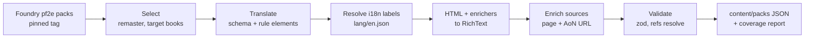

# Content model

Content is everything the rules define: traits, statistics, conditions, actions, ancestries, heritages,
backgrounds, classes and their features, feats, spells, equipment, runes, deities, languages, creatures. It is data
in the database, never code.

## Content entry

Every entry, of every kind, shares one envelope. Kind-specific data hangs off it with its own zod schema.

```ts
interface ContentEntry<K extends ContentKind> {
  id: ContentId; // UUIDv5 of `<pack>/<slug>` (existing scheme, unchanged)
  pack: PackId;
  kind: K;
  slug: Slug; // permanent once published
  name: string;
  level?: number;
  rarity: 'common' | 'uncommon' | 'rare' | 'unique';
  traits: readonly TraitSlug[];
  sources: readonly SourceRef[]; // at least one, see below
  description: RichText; // ORC rules text for official content, author text for homebrew
  rules: readonly RuleElement[];
  display?: DisplayHints; // e.g. feat display category override, see play-and-campaigns.md
  externalIds?: { foundry?: string; aon?: string; pathbuilder?: string };
  supersedes?: readonly ContentId[]; // remaster entry replacing a legacy one
  data: KindData[K];
}
```

### Kinds

| Group      | Kinds                                                                                           |
| ---------- | ----------------------------------------------------------------------------------------------- |
| Rules core | `statistic`, `trait`, `condition`, `action`, `damage-type`, `sense`, `language`, `variant-rule` |
| Build      | `ancestry`, `heritage`, `background`, `class`, `class-feature`, `feat`, `archetype`, `deity`    |
| Magic      | `spell` (incl. focus spells and cantrips), `ritual`, `spellcasting-tradition`                   |
| Equipment  | `weapon`, `armor`, `shield`, `equipment`, `consumable`, `rune`, `treasure`, `kit`               |
| Play       | `effect` (spell and feat effects, GM effects)                                                   |
| Bestiary   | `creature`, `hazard` (later milestone)                                                          |

Class progression (features by level, feat slots, skill increases, boosts) is data on the `class` entry, expressed
as `GrantItem` and slot-granting rule elements keyed by level. The builder's choice slots fall out of the engine;
nothing about level 1 to 20 is hard-coded.

### Rich text

Descriptions are stored as a small, safe document AST (paragraphs, lists, emphasis, tables, and inline nodes), not
HTML. Inline nodes carry semantics so text stays live:

- `ref`: a link to another content entry ("[Off-Guard]", "[Seek]") that opens in place.
- `check`: "DC 20 Athletics", rollable from the text.
- `damage`: "2d6 fire", rollable.
- `template`, `duration`, `action-cost` glyph rendered as text (`[one-action]`, `[reaction]`).

The importer converts Foundry's HTML and enrichers (`@UUID[...]`, `@Check[...]`, `@Damage[...]`, `@Template[...]`)
into this AST.

## Books and source references

Sources are first-class. `content/books.json` is the registry:

```ts
interface Book {
  id: BookId; // 'player-core', 'gm-core', 'monster-core'
  title: string; // 'Pathfinder Player Core'
  publisher: string;
  license: 'ORC' | 'Paizo-CUP' | 'OGL' | 'homebrew';
  remaster: boolean;
  released?: PlainDate;
  aonSourceUrl?: Url; // the book's AoN Sources page
}

type SourceRef =
  | { kind: 'book'; book: BookId; page?: number; aon?: Url }
  | { kind: 'web'; url: Url; title?: string }
  | { kind: 'homebrew'; author: UserId; pack: PackId; url?: Url };
```

Validation: every entry needs at least one source; a `book` source needs a `page`, an `aon` URL, or both. AoN URLs
must be on `2e.aonprd.com` and point at an exact entry (`/Feats.aspx?ID=…`), not a search page. The content
browser shows "Player Core p. 123 · AoN" on every entry. A coverage report lists entries missing a page so they can
be filled in over time.

## Packs and storage

```text
content_books        id, title, publisher, license, remaster, ...
content_packs        id, title, owner_id (null = official), visibility, license, version, content_hash
content_entries      id, pack_id, kind, slug, name, level, rarity, traits text[], data jsonb,
                     search tsvector, updated_at
content_pack_deps    pack_id, depends_on            -- homebrew extending an official pack
```

- **Official packs** are produced by the importer into `content/packs/<pack>/<kind>.json`, reviewed as normal PRs
  (diffable), and upserted on deploy by id. Errata is a re-import and a diff.
- **Homebrew packs** are created in the app and owned by a user. Visibility is private, campaign or public.
- **Overriding official content** in homebrew is a new entry with `supersedes` pointing at the official one.
  The registry resolves supersession per character or campaign, so a GM can house-rule a feat without touching
  the official row.
- **Enabled packs** are chosen per campaign (and per character outside campaigns). The registry is built from
  exactly those packs.

The existing TS content libraries (`libs/content/player-core`, `libs/content/monster-core`) are retired. Thousands
of entries as TypeScript would slow typechecking for no benefit, and homebrew cannot use that path.

### Delivery to the browser

The engine runs client-side, so the browser needs content. Packs are served as immutable, content-hashed bundles
split by kind (`/api/content/player-core/feat.<hash>.json`), cached in IndexedDB, and loaded lazily (spells only
when a caster needs them). Content browser search is server-side through `tsvector` and trait/level indexes.

## Foundry import

`tools/content-import` builds official packs from [foundryvtt/pf2e](https://github.com/foundryvtt/pf2e) at a pinned
release. Their entries already carry rule elements, predicates, traits and `publication { title, license, remaster }`.



- **Selection.** Only `publication.remaster === true` from the target books. Legacy content is out of scope;
  `supersedes` links are recorded where Foundry marks replacements.
- **Translation.** One translator per Foundry rule element key. Untranslatable elements are kept in a report with
  the entry and raw JSON; the report is the backlog for engine work and a CI artefact on content PRs.
- **Coverage report.** Per kind: entries imported, entries with every rule element translated, entries with page
  numbers, entries with AoN URLs. Milestone exit criteria are written against these numbers.
- **Ids.** Our ids stay UUIDv5 of `<pack>/<slug>`. The Foundry compendium UUID goes in `externalIds.foundry`,
  which is what makes Foundry export possible.
- **Source enrichment.** Foundry has the book title but no page numbers or AoN links. Enrichment comes from a
  committed mapping file (`content/sources/<book>.json`: slug → page, AoN id), filled by a matcher over AoN's
  listing data and corrected by hand. The method of obtaining AoN data must respect their terms; this is an open
  question tracked in the roadmap. Until resolved, entries ship with the book reference and whatever page or URL
  is known, and the coverage report shows the gap.

## Licensing

Imported content is ORC-licensed remaster material, so rules text is stored and displayed with ORC attribution.
Reserved Material (Paizo trade dress, art, Golarion names outside ORC) is not imported, or is handled under the
Community Use Policy where Foundry already does so. NOTICE.md is updated in milestone 0 to reflect that prose is
stored. See [ADR-0003](../adr/0003-content-as-data-imported-from-foundry.md).
