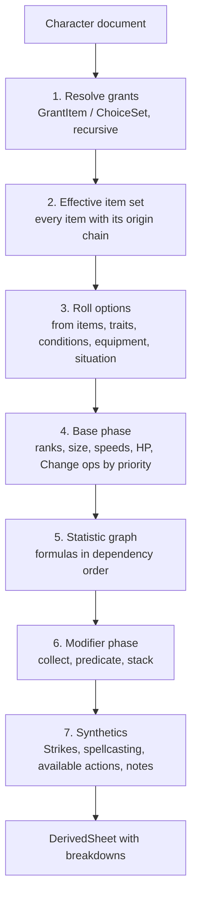

# Rules engine

`libs/rules/engine` turns a character plus loaded content into a sheet, and explains every number on it.
It is pure, synchronous and deterministic: no I/O, no clock, no randomness. Dice live in `libs/rules/dice`.

```ts
derive(input: {
  character: CharacterDocument;   // choices, inventory, play state, overrides
  content: ContentRegistry;       // every enabled pack, official and homebrew
  variants: VariantRuleSet;       // campaign or character variant rules
  situation?: Situation;          // known situational facts, e.g. at roll time
}): DerivedSheet
```

## Core vocabulary

| Concept      | Meaning                                                                                                               |
| ------------ | --------------------------------------------------------------------------------------------------------------------- |
| Statistic    | A named number with a base and modifiers: AC, Perception, Fortitude, Athletics, Strike attack, Speed                  |
| Selector     | The stable key of a statistic: `ac`, `perception`, `save:fortitude`, `skill:athletics`, `speed:land`                  |
| Domain       | A group a statistic belongs to, so one effect can hit many: `all`, `check`, `skill-check`, `dex-based`, `attack-roll` |
| Modifier     | A typed bonus or penalty aimed at selectors or domains, with an optional predicate and an origin                      |
| Rule element | A data instruction on a content entry: grant an item, add a modifier, set a value, offer a choice                     |
| Roll option  | A string fact about the current state, `self:condition:frightened`, `item:trait:agile`, `terrain:forest`              |
| Predicate    | A logic expression over roll options that gates a rule element or modifier                                            |
| Origin       | The chain that explains why something is on the character                                                             |
| Breakdown    | The explained result of a statistic: total, applied lines, suppressed lines, conditional lines, notes                 |

### Statistics are content

Statistic definitions are a content kind (`statistic`), not hard-coded. The core rules pack defines AC, saves,
Perception, the skills, class DC, spell attack and DC, Strikes, speeds, HP and so on. `StatisticDefinition` in
`libs/rules/sdk` (`statistic.ts`) gives each:

- its `selector` and `domains`,
- its `base` formula, written in a small safe expression language (`10 + @attr.dex.capped + @prof.ac`) and
  limited to actor references (`ActorFormulaSource`), since a statistic has no item,
- its `kind`: `check` (rolled) or `dc` (static), and its `keyAttribute` when it has one.

A pack uses each selector once; a second statistic with the same selector is an issue at its `selector`. Two packs
may share one, and `ContentRegistry#statisticsFor(selector)` returns them in registration order; which applies is
the engine's choice.

Homebrew can add statistics (a "Sanity" check, a new skill, a new speed). Variant rules from GM Core are packs
that change formulas or add slots: Proficiency Without Level overrides the proficiency formula, Automatic Bonus
Progression adds potency modifiers and removes rune requirements, Free Archetype adds feat slots. If the engine can
express those three as data, it can express most homebrew; they are acceptance tests for the design.

Formulas are parsed into an AST at import or authoring time and evaluated by an interpreter. No `eval`, no
JavaScript in content.

### Formula language

`libs/rules/formula` parses formula text into a tree. It depends only on the kernel, so `rules/sdk` can check
the formulas in rule elements with it, and the engine evaluates statistic formulas with it. The parser takes any
`FormulaText`, so it can report empty or overlong text; `FormulaSource` in `rules/sdk` is the stored, bounded form,
passed in as `FormulaText.parse(source)`.

```text
formula    = sum
sum        = product (("+" | "-") product)*
product    = unary (("*" | "/") unary)*
unary      = "-" unary | primary
primary    = number | reference | call | "(" sum ")"
number     = digits                                  (whole, 0 to 999999)
reference  = "@" segment ("." segment)*              (@level, @attr.dex.capped)
segment    = [A-Za-z0-9_-]+
call       = function "(" (sum ("," sum)*)? ")"
function   = min | max | floor | ceil | abs | round | sign
           | ternary | eq | ne | gt | gte | lt | lte
```

- The functions are Foundry's `Math` subset and the comparison helpers pf2e adds to `Math`. `min` and `max`
  take one or more arguments, `ternary` three, the comparisons two and the rest one. Any other name is an error.
- Hyphens belong to the reference, as in Foundry's data paths: `@level-1` is one reference, so write `@level - 1`
  to subtract.
- Every node keeps its 1-based position. Errors are message descriptors with a position, and the parse
  outcome has the same shape as the dice parser's.
- `references(formula)` lists every reference with its position. The statistic graph uses it for dependency
  edges.
- `printFormula` prints canonical text with single spaces around operators and only the parentheses the
  tree needs. Parsing that text gives the same tree back.
- Limits: 500 characters, 32 levels of nesting (groups, call arguments
  and negations) and 200 nodes.
- Which reference paths exist and what they mean belongs to the reference vocabulary ("Formula references"
  below). The parser only checks their syntax.

#### Evaluation and rounding

`evaluate(formula, resolve)` is pure: `resolve` gives each reference's value (a safe integer) or reports it
unknown, and the outcome is `{ ok: true, value }` or `{ ok: false, error, position }`, the error a message
descriptor pointing at the node that failed.

The semantics follow Foundry's. pf2e's `RuleElementPF2e#resolveValue` pastes the reference values into the text
(its own `#replaceFormulaData`) and runs it through `Roll.safeEval`, which evaluates it as JavaScript with `Math`
and pf2e's helpers in scope and does not round. `FlatModifier` reads the result with `Number(value) || 0` and
clamps it to its `min` and `max`. So:

- Arithmetic is JavaScript's double arithmetic, in the tree's order. Division keeps fractions: `@level / 2 * 2`
  is `@level`, and `floor`, `ceil` and `round` see the fraction. `round` is `Math.round`, which rounds halves
  up (`round(-2.5)` is -2).
- The language rounds once: the final value is rounded **down** (`Math.floor`), so `@level / 2` at level 5 is
  2 and `-5 / 2` is -3. Foundry would keep 2.5 (ADR-0014). Rounding down is the PF2e default (Player Core,
  "Rounding"), and where a fraction matters Foundry content wraps the division in `floor`, so both agree.
- Comparisons (`eq`, `ne`, `gt`, `gte`, `lt`, `lte`) give 1 or 0, as pf2e's `true` and `false` do in
  arithmetic. `ternary` treats any value but 0 as true and evaluates only the branch it takes.

Where Pioneer deliberately differs from Foundry:

- Pioneer evaluates every formula. pf2e only evaluates text with a reference in it: `1 + 2` stays a string,
  which `FlatModifier` reads as 0.
- A comparison result is 1 or 0 everywhere. pf2e's helpers return booleans and compare strictly, so
  `eq(gte(@level, 5), 1)` is `true === 1`, false, in Foundry and 1 in Pioneer.
- pf2e evaluates both branches of a `ternary`. That only matters when the branch not taken fails.
- A negated negative reference works: pf2e turns `-@x` with `@x = -2` into `--2`, a syntax error, and falls back
  to the rule element's default. Pioneer gives 2.
- Failures Foundry does not have, each pointing at the failing node: an unknown reference (Foundry warns and uses
  the default), division by zero (JavaScript gives `Infinity` or `NaN`), and any value, intermediate ones
  included, outside the safe integer range (where doubles stop holding every whole number). As far as we know,
  Foundry core's `Roll.safeEval` also rejects a result that is not a finite number (a top-level `Infinity` or a
  bare boolean) and falls back to the default. Its source is not public, so this is unverified.

The property tests check the evaluator against a model of Foundry's evaluation: the tree printed as JavaScript,
run with pf2e's `Math` helpers, and rounded down. The model brackets reference values and reads comparisons as
1 or 0, as listed above, and records zero divisors and unsafe values so that every failure the evaluator reports
is one Foundry's JavaScript met too.

#### Formula references

Statistic base formulas and rule element values share one vocabulary of references (ADR-0016), catalogued in
`libs/rules/sdk` (`formula-reference.ts`). Stored formulas use these paths only:

| Reference           | Scope | Value                                                                                  |
| ------------------- | ----- | -------------------------------------------------------------------------------------- |
| `@level`            | actor | The character's level                                                                  |
| `@attr.<attribute>` | actor | The attribute modifier, `@attr.str` to `@attr.cha`                                     |
| `@attr.dex.capped`  | actor | The Dexterity modifier after the armor's Dexterity cap (`DexterityCap`)                |
| `@prof.<selector>`  | actor | The proficiency bonus for a statistic: rank bonus plus level, or 0 when untrained      |
| `@rank.<selector>`  | actor | The proficiency rank for a statistic, 0 (untrained) to 4 (legendary)                   |
| `@stat.<selector>`  | actor | Another statistic's base, before its modifiers, such as the spell attack in a spell DC |
| `@item.level`       | item  | The level of the item the rule element is on                                           |

- A selector's colons are written as dots, since references have none: `@prof.save.fortitude` is the bonus for
  `save:fortitude`, `@rank.attack.martial` the rank for `attack:martial`.
- Scope says whose value a reference reads. A rule element may sit on any content entry, so its formulas may use
  both scopes. Statistic base formulas have no item, so they may only use actor references (`ActorFormulaSource`).
- `FormulaSource` checks a formula when content is validated: it must parse, and every reference must be in the
  catalogue and in scope. A `<selector>` is checked for shape only. Each problem is a field issue at the
  formula's JSON path. Its descriptor includes `position`, the 1-based position in the formula. A Foundry spelling
  gets an error naming the path to write instead.
- The fields checked are `FlatModifier.value`, `DexterityCap.value`, `AdjustModifier.value`, `Change.value`,
  `MultipleAttackPenalty.value`, a numeric `ItemAlteration.value` and `MartialProficiency.value`. The last takes a
  rank name or, as in Foundry, a formula giving a rank. The engine resolves it as pf2e does: a result of 0 or no
  value becomes 1 (trained), and anything else is clamped to 1 to 4. Foundry also allows a bare number, which the
  importer turns into the rank name.

The catalogue also holds the Foundry spellings the importer translates (`FOUNDRY_REFERENCES`, with
`fromFoundryPath`). Placeholders carry across by name:

| Foundry                                                                       | Pioneer                    |
| ----------------------------------------------------------------------------- | -------------------------- |
| `@actor.level`, `@actor.system.details.level.value`                           | `@level`                   |
| `@actor.abilities.<attribute>.mod`, `@actor.system.abilities.<attribute>.mod` | `@attr.<attribute>`        |
| `@actor.skills.<skill>.rank`, `@actor.system.skills.<skill>.rank`             | `@rank.skill.<skill>`      |
| `@actor.saves.<save>.rank`, `@actor.system.saves.<save>.rank`                 | `@rank.save.<save>`        |
| `@actor.perception.rank`, `@actor.system.perception.rank`                     | `@rank.perception`         |
| `@actor.system.proficiencies.attacks.<category>.rank`                         | `@rank.attack.<category>`  |
| `@actor.system.proficiencies.defenses.<category>.rank`                        | `@rank.defense.<category>` |
| `@item.level`, `@item.system.level.value`                                     | `@item.level`              |

The importer reports any other Foundry path as untranslatable. The exporter writes the first spelling listed. Paths
join the catalogue when the engine can supply their values. Formulas inside Foundry's bracketed values and
`{item|...}` injections are left to the Epic 2.6 translators.

## Modifiers and stacking

`libs/rules/engine` (`breakdown.ts`) defines these types. Overrides and roll notes join the breakdown with their own
stories.

```ts
interface Modifier {
  id: RuleId; // `<entry>#<rule>`: the rule element that made it, stable across derivations
  slug: RuleSlug | undefined; // lets an AdjustModifier find it
  label: { text: ContentText } | { entry: ContentId }; // the element's display.label, else its entry's name
  type: 'untyped' | 'status' | 'circumstance' | 'item' | 'proficiency' | 'attribute' | 'potency';
  targets: readonly ModifierTarget[]; // selectors or domains
  predicate: Predicate | undefined;
  origin: Origin;
}
```

PF2e stacking: within each typed category only the highest bonus and the lowest penalty apply; untyped bonuses
and penalties all apply; attribute and proficiency are single values set by the base formula. The engine applies
this and keeps the losers:

```ts
interface BreakdownLine {
  modifier: Modifier;
  value: FormulaValue | undefined; // after adjustments; undefined only when failed
  adjustedBy: readonly RuleId[]; // the AdjustModifiers that changed it, in order
  status:
    | { kind: 'applied' }
    | { kind: 'suppressed'; by: RuleId; reason: 'stacking' | 'adjustment' } // lower status bonus; AdjustModifier suppress
    | { kind: 'conditional'; when: Predicate; summary: PredicateSummary | undefined } // depends on unknown situation
    | { kind: 'inactive'; reason: 'predicate' } // predicate known false
    | { kind: 'failed'; error: MessageDescriptor; position: TextPosition }; // a formula failed to evaluate
}

interface StatisticValue {
  selector: Selector;
  base: BaseTerm[]; // each formula term
  formulaValue: FormulaValue; // what the terms add up to
  baseValue: FormulaValue; // after the base phase's Changes; what modifiers add to and @stat reads
  lines: BreakdownLine[];
  computed: FormulaValue; // baseValue plus the applied lines
  total: FormulaValue; // computed, or the value a set override pinned it to
  overrides: OverrideLine[]; // Changes in the order they ran, then set overrides
  pinnedBy: RuleId | undefined; // the set override that pinned the total
}

interface OverrideLine {
  id: RuleId;
  label: ModifierLabel;
  origin: Origin; // who or what did it; a set override's has an override hop
  phase: 'base' | 'total';
  mode: 'add' | 'multiply' | 'upgrade' | 'downgrade' | 'override';
  value: RuleNumber | undefined;
  replaced: FormulaValue; // the value before this line
  result: FormulaValue; // the value after it
  status: applied | { replaced; by } | conditional | inactive | failed;
}
```

`deriveStatistics(definitions, inputs, { rules, facts })` runs the base phase (below, with its `Change`s), then for
each statistic:

1. **Collect.** A `FlatModifier` in play becomes a modifier. It reaches a statistic when one of its targets is the
   statistic's selector, one of its `domains`, or `all`.
2. **Value.** A number is used as written. A formula is evaluated with the character's inputs, `@stat.<selector>`
   (another statistic's base) and `@item.level` (the level of the item the element is on). A failure makes the line
   `failed`; it never throws.
3. **Adjust.** Each `AdjustModifier` that reaches the statistic and whose predicate is known to hold runs, in
   priority order (Foundry's default 100) and then id order, on the modifiers with its `slug` (all of them when it
   has none). `add`, `subtract`, `multiply`, `upgrade` (at least), `downgrade` (at most) and `override` change the
   value, rounded down; `suppress` removes the line, naming the adjustment. An adjustment whose predicate depends on
   the situation does not run yet.
4. **Gate.** The predicate, in Kleene logic against the derivation's roll options: true applies, false is inactive,
   unknown is conditional, with a `PredicateSummary` (or the element's `display.summary`).
5. **Stack.** Among applied, typed lines, each type's highest bonus and lowest penalty apply and the rest are
   suppressed by the winner. A tie goes to the smaller id, so the result does not depend on the order of the rules.

The computed total is the base plus the applied lines; a set override may then pin it ("Overrides"). Property
tests check order independence, that the computed total is the base plus the applied lines, that untyped modifiers
always sum, that adding a typed bonus no higher than one already applied never raises the total, and that a set
override always wins while the computed value is still reported.

That is the AC stack the sheet shows: base 10, Dexterity capped by the armour, proficiency from the class, the
armour's item bonus, a shield raised (conditional), _frightened 1_ (status penalty, applied, from the condition,
caused by a Demoralize logged in the campaign), a lower status bonus suppressed by a higher one, and any manual
override with who set it.

Damage uses the same machinery with extra line kinds: damage dice, damage type changes, critical specialisation,
and immunity, weakness and resistance adjustments.

## Rule elements

Rule elements are the only way content changes a character. The vocabulary follows Foundry pf2e's semantics,
because that is the dataset we import and the system we export to (see
[ADR-0008](../adr/0008-rule-element-vocabulary.md)). Our schema is typed; theirs targets raw data paths.

| Group       | Rule elements                                                                                                                     |
| ----------- | --------------------------------------------------------------------------------------------------------------------------------- |
| Structure   | `GrantItem`, `ChoiceSet`, `RollOption` (incl. toggles), `ItemAlteration`                                                          |
| Numbers     | `FlatModifier`, `AdjustModifier`, `Change` (add, upgrade, downgrade, override, multiply), `DexterityCap`, `MultipleAttackPenalty` |
| Proficiency | `Proficiency` (raise a rank), `MartialProficiency`                                                                                |
| Checks      | `RollTwice`, `SubstituteRoll`, `AdjustDegreeOfSuccess`, `RollNote`                                                                |
| Strikes     | `Strike`, `AdjustStrike`, `DamageDice`, `DamageAlteration`, `CriticalSpecialization`                                              |
| Defences    | `Immunity`, `Weakness`, `Resistance`, `TempHitPoints`, `FastHealing`                                                              |
| Creature    | `BaseSpeed`, `Sense`, `CreatureSize`, `Language`, `SpecialResource`, `SpecialStatistic`, `Aura`                                   |
| Actions     | `GrantAction` (an action becomes available, with its own predicate)                                                               |

Each element is a discriminated union member with its own zod schema in `libs/rules/sdk`. Every element has an
optional `predicate`, a `priority`, and an optional `display` hint. Unknown keys are a validation error; the
importer reports Foundry elements it cannot translate rather than dropping them silently.

The Structure, Numbers and Proficiency groups are in the SDK. `Proficiency` raises one statistic's rank on its
selector, weapon and armour categories included (`attack:martial`), standing in for Foundry's rank
`ActiveEffectLike` upgrades. `MartialProficiency` keeps Foundry's schema and defaults: a new proficiency for the
weapons or armour a predicate defines, whose rank can follow a category's (`sameAs`) up to `maxRank`. The Checks,
Strikes, Defences, Creature and Actions groups land with their Epic 2.6 translator stories, so each schema arrives
with the Foundry content that exercises it.

## Derivation pipeline



1. **Grants.** Starting from the character's direct choices (ancestry, heritage, background, class, feats, items,
   conditions, effects), resolve `GrantItem` and `ChoiceSet` recursively. Class features at each level, feats that
   grant actions or spells, conditions that imply other conditions (_grabbed_ grants _off-guard_). Cycles are an
   error. Unresolved choices become open slots for the builder.
2. **Effective set.** The flat list of every item in play, each with its origin chain.
3. **Roll options.** Facts derived from the set and the play state. Situational facts come from `situation`.
4. **Base phase.** `Change` operations in priority order (Foundry's ordering: add, multiply, upgrade, downgrade,
   override), proficiency rank upgrades (highest wins, all contributors listed).
5. **Statistic graph.** Statistics form a DAG through their formulas (AC depends on Dexterity, which depends on
   boosts). Evaluated in topological order, memoised, cycles reported with the offending formula.
6. **Modifiers.** Collected per selector through domains, predicates evaluated, stacking applied.
7. **Synthetics.** Strikes per wielded weapon, spellcasting entries, the available action list, roll notes.

### Grant resolution

Steps 1 and 2 live in `libs/rules/grants` (`resolveGrants`), beside the engine rather than in it: it depends only on
`rules/sdk`, `rules/predicate` and the kernel, and the engine composes it. It reads content through a lookup
(`ContentId` to kind, name, rule elements, sources and the entry's own roll options, and every entry of a kind), so
any kind of entry can grant any other.

- Roots are the character's direct entries, each with the hop that put it there (a `choice` slot, a `condition`, an
  `effect`). They are visited in entry id order, so the result does not depend on the order they are given in.
- A fixed `GrantItem` adds its entry with a `grant` hop naming the granter and the rule index. Each item's origin is
  the hops from the character down to it, with the item itself as `entry`.
- A grant of an entry already on the character is skipped and reported as a duplicate, unless `allowDuplicate`.
- A grant back to an entry above it on the chain is a cycle, reported once with every entry on it and not followed.
  A missing entry is an error at its grant, and a chain longer than an origin records (64 hops) stops there. The
  other grants still resolve.
- A grant's predicate is evaluated like a modifier's. True follows the grant, false drops it, and unknown reports it
  as a **conditional grant** with its predicate summary: not on the character, and not followed further.
- An inline `ChoiceSet` whose predicate is true is a **slot**, keyed `<entry id>:<rule index>`. The entry is on the
  character once, so the key is stable however it got there, and picks (slot key to value) survive re-resolution.
  Options whose predicate is false are left out; unknown ones are offered with their summary.
- A pick among the offered options answers the slot, and its `rollOption` sets `<rollOption>:<pick>`. A
  `GrantItem { choice: <flag> }` on the same entry grants the picked entry behind a `choice` hop, then a `grant` hop.
  With no pick the slot is **open** and the grant waits; a pick not on offer is an error and the slot reopens. A pick
  that is a plain option, not an entry, cannot be granted. Removing a pick drops everything granted through it.
- A `ChoiceSet` whose `choices` is a query (`{ kind, filter }`) offers every entry of that kind whose filter is not
  false, as one slot like any other. The filter reads the character's facts, with the candidate's own roll options
  under `item:` (`item:trait:fighter`, `item:level:1`, as Foundry writes them). They replace whatever the character
  has under `item:`, and never mix with its `feat:` or `self:` facts. Unknown candidates are offered with their
  summary. Offers sort by name, then id, so a builder list is stable. A query that matches nothing is an open slot
  with an empty offer, not an error.

#### Facts from the set, to a fixpoint

Grant and choice predicates read facts the set itself provides, so resolution runs in rounds. Each round walks the
grants as above against the facts of the round before, then derives the facts again from the set it reached:

- the level, as `self:level:<level>` (an input; a negative level sets none);
- each entry's kind option, as Foundry writes it: `class:fighter`, `feature:<slug>` for a class feature,
  `feat:<slug>`, `ancestry:`, `heritage:`, `background:`, `self:condition:<slug>`, `self:effect:<slug>`. Creatures
  and statistics set none;
- each `RollOption` element in the `all` domain whose predicate holds: a static one unless its `value` is false, and
  a toggle while it is on. A toggle's state comes from input keyed `<entry id>:<rule index>`, else its `value`; while
  on it also sets `<option>:<suboption>` for the picked suboption if offered, else the first offered. Options in
  other domains only reach rolls in them, so grants never read them;
- each answered slot's `<rollOption>:<pick>`, with every namespace a `ChoiceSet` on the set writes to made known.

The supplied situation (`terrain:forest`) is added on top. Facts are rebuilt from scratch every round, so an entry
whose predicate stops holding drops out with what it set. Once a round's set derives the facts it read, it has
settled: the result is that round's items, slots, conditional grants and toggles, its derived `rollOptions`, and
its `facts` for step 3.

A round that derives facts an earlier round read never settles: a grant negated by what it grants (or a roll
option that undoes itself). Only the entries every round in the loop has are kept, with the options they all
agree on, and an error names the entries that come and go or set what comes and goes. Rounds are capped at 32; past
that the last two rounds are compared the same way. Resolution always ends.

The golden Level 1 Fighter (`testing/fighter.ts`) resolves to its class, Shield Block, Reactive Strike, the skill
choice and a class feat slot; at 20th level with every slot picked it settles in a few rounds well inside its 3 ms
bench budget.

### Statistic graph

The base phase in `libs/rules/engine` (`StatisticBases`) is step 5. The inputs are the character's
level, attribute modifiers, proficiency rank per selector (a selector left out is untrained) and the armor's Dexterity
cap; grant resolution (Epic 1.4) will produce them, and until then they are supplied directly.

- Edges come from `references(formula)`. `@prof.<selector>` and `@rank.<selector>` read that selector's rank, an
  input, so they add no edge between statistics. `@stat.<selector>` reads another statistic's base and is the
  edge.
- A later definition of a selector replaces an earlier one, as a pack registered later (homebrew after core)
  restates a statistic.
- Evaluation follows Tarjan's strongly connected components, which come out dependencies first, so each statistic
  is evaluated once and the work is linear in statistics plus references. Statistics are visited in selector order,
  so the result does not depend on the order of the definitions.
- A component of several statistics, or one that reads itself, is a cycle. Each statistic in it fails at its
  first reference into the cycle, and the error names every statistic in it. A reference to a missing statistic,
  or to one that failed, is an error at that reference. A formula that fails to evaluate fails as the formula
  evaluator reports. None of these throws, and the other statistics still evaluate.
- Each top-level term of the base formula becomes a `BaseTerm` with its printed text, sign, value and position:
  `10`, `@attr.dex.capped`, `@prof.ac`. A bracketed sum stays one term. Each term is evaluated and rounded down on
  its own; if the terms then miss the formula's value (`@level / 2 + @level / 2` at an odd level), a rounding line
  makes up the difference, so the lines always add up to the base.

`@stat.<selector>` reads the other statistic's base, not its total. Modifiers reach each statistic through its own
selector and domains, so a bonus to spell attack rolls does not leak into a spell DC built on the spell attack, and
modifiers never depend on other modifiers.

Performance target: full derivation of a level 20 character in under 10 ms in the browser, so the builder can
re-derive on every keystroke. Incremental recomputation is an optimisation for later, not a design constraint.

## Predicates and conditional modifiers

Predicates use Foundry's JSON shape so imported content needs no rewriting: an array means _all_, plus `or`, `and`,
`not`, `nor`, `gte`, `lte` and friends over roll options.

The difference is evaluation. Foundry evaluates at roll time with full context. We also evaluate on the static
sheet, where the situation is unknown, so predicates use **three-valued (Kleene) logic**:

- Roll option namespaces are classified. `self:*`, `item:*`, `class:*`, `feat:*` are _known_: present means true,
  absent means false. Namespaces such as `action:*`, `terrain:*`, `target:*`, `check:*` and `situation:*` are
  _situational_: absent means **unknown**, not false.
- `and`, `or` and `not` follow Kleene logic, so `["action:seek", "terrain:forest"]` is unknown on the sheet.
- A modifier whose predicate is **true** applies, **false** is inactive, **unknown** becomes a **conditional
  line**. The UI renders it as "+1 circumstance to Seek when in forest (Favored Terrain)" next to the statistic.
- At roll time the roll dialog lists the conditional lines for that statistic as toggles, pre-filled from the
  known situation (in an encounter, using Stealth for initiative). Choosing them supplies facts, re-evaluates, and
  the roll records which were used.

### Evaluation

`libs/rules/predicate` evaluates predicates. It depends only on `rules/sdk` and the kernel, so grants and statistics
share it.

```ts
const facts = new PredicateFacts(rollOptions, namespaces); // once per derivation; indexes numeric suffixes
evaluatePredicate(predicate, facts); // 'true' | 'false' | 'unknown'
tracePredicate(predicate, facts); // the same, with every nested statement's verdict, for explaining
```

The namespace is a roll option's first word. `DEFAULT_NAMESPACES` was checked against the roll options in Foundry's
feats, class and ancestry features, conditions, effects and equipment:

| Kind        | Namespaces                                                                                                                                                                                                                               |
| ----------- | ---------------------------------------------------------------------------------------------------------------------------------------------------------------------------------------------------------------------------------------- |
| Known       | `self`, `item`, `parent`, `class`, `feat`, `feature`, `ancestry`, `heritage`, `background`, `deity`, `armor`, `skill`, `defense`                                                                                                         |
| Situational | `self:action`, `self:flanking`, `self:participant`, `action`, `attack`, `bonus`, `check`, `damage`, `encounter`, `inflicts`, `lighting`, `origin`, `penalty`, `proficiency`, `situation`, `spellcasting`, `target`, `terrain`, any other |

The longest listed namespace an option starts with decides, so `self:participant:initiative:rank` is situational
while `self:effect:rage` is known. `item` and `parent` are known because the engine always evaluates them against a
specific item. A namespace missing from the table is situational, so a gap shows up as a conditional line instead of
hiding a modifier. The namespaces a `ChoiceSet` writes its pick to (`kinetic-gate:air`) are the character's own
facts: grant resolution adds them as known with `withKnown`. The core rules pack will own the table (Epic 1.6).

Statements follow Foundry's `Predicate.test`, lifted to three values:

- A plain option is true when present. Missing, it is false in a known namespace and unknown otherwise.
- `and`, `or` and `not` are Kleene's. `nand` and `nor` are their negations, and `if`/`then` is `not if or then`.
  `xor` is true when exactly one is true and nothing is unknown, false once two are true. `iff` is false once one
  is true and another false, and unknown while any is unknown.
- `{ "eq": [a, b] }` with two options compares their text, as Foundry does, so it never depends on the facts. With a
  number, it looks for `a:b`. Missing, that is false once `a` is in a known namespace or has some other value, and
  unknown before.
- `gt`, `gte`, `lt` and `lte` read every number after `a:` (`self:level:5` gives 5) and hold when some value of `a`
  beats every value of `b`. An operand with no value makes the test false if its namespace is known, and unknown if
  it is situational. Once an option has a value, it is settled: further values of the same option are not expected.

Summaries for conditional lines are generated from the predicate with a per-locale vocabulary table
(`terrain:forest` reads "in forest"), with an optional authored `summary` for anything the generator renders badly.

```ts
summarisePredicate(predicate, facts, element.display?.summary); // PredicateSummary | undefined
formatSummary(summary, { message, list }); // text in the viewer's locale
```

`summarisePredicate` returns a tree only while the predicate is unknown. It keeps the unknown parts and drops the
parts known to hold: `["self:effect:rage", "terrain:forest"]` while raging summarises as "you are in forest".
Phrases are bare conditions, and negation is pushed down to them (each message has a `negated` select: "you are not
in darkness"), so no "unless" has to reach over a list. `and` and `or` become locale lists, and a list inside another
is introduced with "either" or "both" so its scope reads clearly. `if`/`then` reads as "not the condition, or the
consequence", and `xor` and `iff` reduce to what is left to decide. The UI wraps the result: "It holds when
…".

The vocabulary is a prefix table in `libs/rules/predicate` (`action`, `terrain`, `lighting`, `target:trait`,
`target:condition`, `target:mark`, `self:participant:initiative:stat`). Each prefix has one message whose ICU `select`
maps the rest of the option to words, with the slug as the fallback, so translators extend the vocabulary in message
files. Select keys use `_` for `-`, which ICU does not allow. Other options read "`option` applies", and comparisons
name the option and the value. An authored `display.summary` on the rule element replaces the whole generated summary.

## Messages, not strings

The engine never produces display text. Labels, suppression reasons, conditional summaries, unavailability reasons
and validation errors are message descriptors (`{ key: 'breakdown.suppressed.stacking', params: { by } }`) or
content text references (`{ entry, field: 'name' }`). The UI formats them in the viewer's locale with ICU
MessageFormat. Tests assert on keys and params. See [ADR-0009](../adr/0009-i18n-and-lazy-loading.md).

## Provenance

```ts
type OriginHop =
  | { kind: 'choice'; slot: SlotKey } // the player picked it
  | { kind: 'grant'; by: ContentId; rule: number } // granted by another item's rule element
  | { kind: 'inventory'; item: InventoryItemId; state: 'worn' | 'held' | 'invested' }
  | { kind: 'condition'; condition: ContentId; value?: number; appliedBy?: EventRef }
  | { kind: 'effect'; effect: ContentId; appliedBy?: EventRef }
  | { kind: 'override'; by: UserId; at: Instant; note?: string }
  | { kind: 'variant'; rule: ContentId };

interface Origin {
  hops: readonly OriginHop[]; // outermost first: Fighter -> Shield Block feature -> Shield Block action
  entry: ContentId; // the content entry holding the rule element
  sources: readonly SourceRef[]; // that entry's book/page/AoN references
}
```

Every breakdown line, granted item, available action and open choice slot carries an origin. "Why is my AC 18?"
and "where did this action come from?" are the same query.

## Overrides

Overrides are rule elements with an `override` origin hop, injected from the character document. They never
replace derived data in storage. Two modes:

- **Adjust:** an extra modifier ("GM blessing, +1 status to AC"), a `FlatModifier` with an override origin. Goes
  through normal stacking.
- **Set:** pin a statistic to a value, a `Change` with mode `override` and an override origin. It acts on the total
  after modifiers, not the base, so other statistics' `@stat` references still read the computed base. Of several,
  the last by priority and then id wins; the others are listed as replaced by it. The breakdown keeps the computed
  value (`computed`), the pinned value (`total`), and `pinnedBy`, whose origin says who pinned it, when and why. Set
  overrides are visually flagged everywhere the statistic appears.

Every other `Change` runs in the base phase, on the value the base formula gives, in Foundry's mode order (add,
multiply, upgrade, downgrade, override), then priority, then id. Each is an `OverrideLine` with the value it
replaced; a change whose predicate does not hold or depends on the situation, or whose formula fails, leaves the
value as it was. A change's formula reads the inputs and the level of the item it is on, not `@stat`, so changes
add no edges to the statistic graph.

Custom effects (ad hoc homebrew attached to one character) are the same thing with more than one rule element.

## Testing strategy

- Property tests: stacking invariants (order independence, adding a lower typed bonus never raises the total,
  untyped always sums), Kleene laws for predicates, formula evaluator against a reference.
- Golden tests: Paizo pregens (Foundry's `paizo-pregens` and `iconics` packs) derived and compared against
  their published statistics.
- Each rule element type has fixture tests with hand-written content in `libs/rules/engine/testing`.
