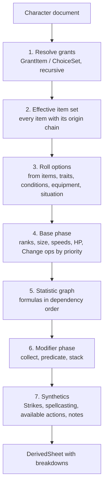

# Rules engine

`libs/rules/engine` turns a character plus loaded content into a sheet, and explains every number on it.
It is pure, synchronous and deterministic: no I/O, no clock, no randomness. Dice live in `libs/rules/dice`.

```ts
derive(input: {
  character: CharacterDocument;   // choices, inventory, play state, overrides
  content: ContentRegistry;       // every enabled pack, official and homebrew
  variants: VariantRuleSet;       // campaign or character variant rules
  situation?: Situation;          // known situational facts, e.g. at roll time
}): DerivedSheet
```

## Core vocabulary

| Concept      | Meaning                                                                                                               |
| ------------ | --------------------------------------------------------------------------------------------------------------------- |
| Statistic    | A named number with a base and modifiers: AC, Perception, Fortitude, Athletics, Strike attack, Speed                  |
| Selector     | The stable key of a statistic: `ac`, `perception`, `save:fortitude`, `skill:athletics`, `speed:land`                  |
| Domain       | A group a statistic belongs to, so one effect can hit many: `all`, `check`, `skill-check`, `dex-based`, `attack-roll` |
| Modifier     | A typed bonus or penalty aimed at selectors or domains, with an optional predicate and an origin                      |
| Rule element | A data instruction on a content entry: grant an item, add a modifier, set a value, offer a choice                     |
| Roll option  | A string fact about the current state, `self:condition:frightened`, `item:trait:agile`, `terrain:forest`              |
| Predicate    | A logic expression over roll options that gates a rule element or modifier                                            |
| Origin       | The chain that explains why something is on the character                                                             |
| Breakdown    | The explained result of a statistic: total, applied lines, suppressed lines, conditional lines, notes                 |

### Statistics are content

Statistic definitions are a content kind, not hard-coded. The core rules pack defines AC, saves, Perception, the
skills, class DC, spell attack and DC, Strikes, speeds, HP and so on, each with:

- its selector and domains,
- its base formula, written in a small safe expression language (`10 + @attr.dex.capped + @prof.armor + @level`),
- whether it is a check (rolled) or a DC (static), and its key attribute when relevant.

Homebrew can add statistics (a "Sanity" check, a new skill, a new speed). Variant rules from GM Core are packs
that change formulas or add slots: Proficiency Without Level overrides the proficiency formula, Automatic Bonus
Progression adds potency modifiers and removes rune requirements, Free Archetype adds feat slots. If the engine can
express those three as data, it can express most homebrew; they are acceptance tests for the design.

Formulas are parsed into an AST at import or authoring time and evaluated by an interpreter. No `eval`, no
JavaScript in content.

## Modifiers and stacking

```ts
interface Modifier {
  id: string;
  label: Message; // message descriptor or content text ref, never a raw string
  value: number | Formula;
  type: 'untyped' | 'status' | 'circumstance' | 'item' | 'proficiency' | 'attribute' | 'potency';
  targets: readonly Selector[]; // selectors or domains
  predicate?: Predicate;
  origin: Origin;
}
```

PF2e stacking: within each typed category only the highest bonus and the lowest penalty apply; untyped bonuses
and penalties all apply; attribute and proficiency are single values set by the base formula. The engine applies
this and keeps the losers:

```ts
interface BreakdownLine {
  modifier: Modifier;
  value: number;
  status:
    | { kind: 'applied' }
    | { kind: 'suppressed'; by: ModifierId; reason: 'stacking' } // e.g. lower status bonus
    | { kind: 'conditional'; when: Predicate; summary: string } // depends on unknown situation
    | { kind: 'inactive'; reason: string }; // predicate known false, toggle off
}

interface Breakdown {
  selector: Selector;
  total: number;
  base: BaseTerm[]; // each formula term, with its own origin
  lines: BreakdownLine[];
  overrides: OverrideLine[]; // "set to X" effects, with the value they replaced
  notes: RollNote[]; // text-only reminders, also predicate-gated
}
```

That is the AC stack the sheet shows: base 10, Dexterity capped by the armour, proficiency from the class, the
armour's item bonus, a shield raised (conditional), _frightened 1_ (status penalty, applied, from the condition,
caused by a Demoralize logged in the campaign), a lower status bonus suppressed by a higher one, and any manual
override with who set it.

Damage uses the same machinery with extra line kinds: damage dice, damage type changes, critical specialisation,
and immunity, weakness and resistance adjustments.

## Rule elements

Rule elements are the only way content changes a character. The vocabulary follows Foundry pf2e's semantics,
because that is the dataset we import and the system we export to (see
[ADR-0008](../adr/0008-rule-element-vocabulary.md)). Our schema is typed; theirs targets raw data paths.

| Group       | Rule elements                                                                                                                     |
| ----------- | --------------------------------------------------------------------------------------------------------------------------------- |
| Structure   | `GrantItem`, `ChoiceSet`, `RollOption` (incl. toggles), `ItemAlteration`                                                          |
| Numbers     | `FlatModifier`, `AdjustModifier`, `Change` (add, upgrade, downgrade, override, multiply), `DexterityCap`, `MultipleAttackPenalty` |
| Proficiency | `Proficiency` (raise a rank), `MartialProficiency`                                                                                |
| Checks      | `RollTwice`, `SubstituteRoll`, `AdjustDegreeOfSuccess`, `RollNote`                                                                |
| Strikes     | `Strike`, `AdjustStrike`, `DamageDice`, `DamageAlteration`, `CriticalSpecialization`                                              |
| Defences    | `Immunity`, `Weakness`, `Resistance`, `TempHitPoints`, `FastHealing`                                                              |
| Creature    | `BaseSpeed`, `Sense`, `CreatureSize`, `Language`, `SpecialResource`, `SpecialStatistic`, `Aura`                                   |
| Actions     | `GrantAction` (an action becomes available, with its own predicate)                                                               |

Each element is a discriminated union member with its own zod schema in `libs/rules/sdk`. Every element has an
optional `predicate`, a `priority`, and an optional `display` hint. Unknown keys are a validation error; the
importer reports Foundry elements it cannot translate rather than dropping them silently.

The Structure, Numbers and Proficiency groups are in the SDK. `Proficiency` raises one statistic's rank on its
selector, standing in for Foundry's rank `ActiveEffectLike` upgrades; `MartialProficiency` raises a weapon or armour
category, or a group defined by predicate that can follow a category's rank (`sameAs`). The Checks, Strikes,
Defences, Creature and Actions groups land with their Epic 2.6 translator stories, so each schema arrives with the
Foundry content that exercises it.

## Derivation pipeline



1. **Grants.** Starting from the character's direct choices (ancestry, heritage, background, class, feats, items,
   conditions, effects), resolve `GrantItem` and `ChoiceSet` recursively. Class features at each level, feats that
   grant actions or spells, conditions that imply other conditions (_grabbed_ grants _off-guard_). Cycles are an
   error. Unresolved choices become open slots for the builder.
2. **Effective set.** The flat list of every item in play, each with its origin chain.
3. **Roll options.** Facts derived from the set and the play state. Situational facts come from `situation`.
4. **Base phase.** `Change` operations in priority order (Foundry's ordering: add, multiply, upgrade, downgrade,
   override), proficiency rank upgrades (highest wins, all contributors listed).
5. **Statistic graph.** Statistics form a DAG through their formulas (AC depends on Dexterity, which depends on
   boosts). Evaluated in topological order, memoised, cycles reported with the offending formula.
6. **Modifiers.** Collected per selector through domains, predicates evaluated, stacking applied.
7. **Synthetics.** Strikes per wielded weapon, spellcasting entries, the available action list, roll notes.

Performance target: full derivation of a level 20 character in under 10 ms in the browser, so the builder can
re-derive on every keystroke. Incremental recomputation is an optimisation for later, not a design constraint.

## Predicates and conditional modifiers

Predicates use Foundry's JSON shape so imported content needs no rewriting: an array means _all_, plus `or`, `and`,
`not`, `nor`, `gte`, `lte` and friends over roll options.

The difference is evaluation. Foundry evaluates at roll time with full context. We also evaluate on the static
sheet, where the situation is unknown, so predicates use **three-valued (Kleene) logic**:

- Roll option namespaces are classified. `self:*`, `item:*`, `class:*`, `feat:*` are _known_: present means true,
  absent means false. Namespaces such as `action:*`, `terrain:*`, `target:*`, `check:*` and `situation:*` are
  _situational_: absent means **unknown**, not false.
- `and`, `or` and `not` follow Kleene logic, so `["action:seek", "terrain:forest"]` is unknown on the sheet.
- A modifier whose predicate is **true** applies, **false** is inactive, **unknown** becomes a **conditional
  line**. The UI renders it as "+1 circumstance to Seek when in forest (Favored Terrain)" next to the statistic.
- At roll time the roll dialog lists the conditional lines for that statistic as toggles, pre-filled from the
  known situation (in an encounter, using Stealth for initiative). Choosing them supplies facts, re-evaluates, and
  the roll records which were used.

Summaries for conditional lines are generated from the predicate with a per-locale vocabulary table
(`terrain:forest` reads "in forest"), with an optional authored `summary` for anything the generator renders badly.

## Messages, not strings

The engine never produces display text. Labels, suppression reasons, conditional summaries, unavailability reasons
and validation errors are message descriptors (`{ key: 'breakdown.suppressed.stacking', params: { by } }`) or
content text references (`{ entry, field: 'name' }`). The UI formats them in the viewer's locale with ICU
MessageFormat. Tests assert on keys and params. See [ADR-0009](../adr/0009-i18n-and-lazy-loading.md).

## Provenance

```ts
type OriginHop =
  | { kind: 'choice'; slot: SlotKey } // the player picked it
  | { kind: 'grant'; by: ContentId; rule: number } // granted by another item's rule element
  | { kind: 'inventory'; item: InventoryItemId; state: 'worn' | 'held' | 'invested' }
  | { kind: 'condition'; condition: ContentId; value?: number; appliedBy?: EventRef }
  | { kind: 'effect'; effect: ContentId; appliedBy?: EventRef }
  | { kind: 'override'; by: UserId; at: Instant; note?: string }
  | { kind: 'variant'; rule: ContentId };

interface Origin {
  hops: readonly OriginHop[]; // outermost first: Fighter -> Shield Block feature -> Shield Block action
  entry: ContentId; // the content entry holding the rule element
  sources: readonly SourceRef[]; // that entry's book/page/AoN references
}
```

Every breakdown line, granted item, available action and open choice slot carries an origin. "Why is my AC 18?"
and "where did this action come from?" are the same query.

## Overrides

Overrides are rule elements with an `override` origin hop, injected from the character document. They never
replace derived data in storage. Two modes:

- **Adjust:** an extra modifier ("GM blessing, +1 status to AC"). Goes through normal stacking.
- **Set:** pin a statistic to a value. The breakdown shows the computed value, the pinned value, who pinned it and
  why. Set overrides are visually flagged everywhere the statistic appears.

Custom effects (ad hoc homebrew attached to one character) are the same thing with more than one rule element.

## Testing strategy

- Property tests: stacking invariants (order independence, adding a lower typed bonus never raises the total,
  untyped always sums), Kleene laws for predicates, formula evaluator against a reference.
- Golden tests: Paizo pregens (Foundry's `paizo-pregens` and `iconics` packs) derived and compared against
  their published statistics.
- Each rule element type has fixture tests with hand-written content in `libs/rules/engine/testing`.
