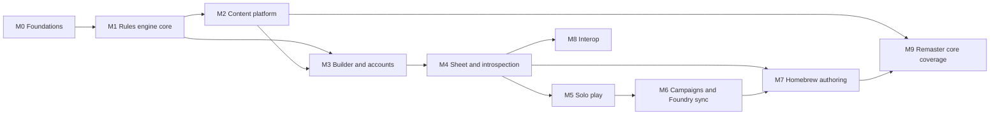

# Roadmap

Mechanics first, breadth later. Every milestone uses Player Core as its dataset; more books arrive in M9.
Milestones are GitHub milestones; epics are issues labelled `type:epic` with their stories as sub-issues.

M1 and M2 overlap: once the M1 schemas land, the importer can be built against them while the engine grows.
M7 needs M6 only for per-campaign variant rules; the rest of M7, and all of M8, can run alongside M5 and M6.

## M0 Foundations

Exit: architecture and ADRs merged and accepted; labels, milestones, epics and board exist.

- **Architecture and ADRs** (PR #4), including the NOTICE.md licensing update.
- **GitHub project setup**: labels, milestones, project board, issue templates (epic, story, bug, content error).
- **i18n foundation**: runtime locale switching, ICU messages, route-scoped lazy message loading with idle
  prefetch, locale resolution, `Intl` formatting, unit display, lint against literal template text, missing-key
  CI check; extract the existing UI strings. Library: Transloco (ADR 0009).
- **Legal page**: public page linked from every footer: Paizo Community Use notice, ORC attribution, "all content
  derived from Foundry pf2e" with the pinned release link. Content cache downloads join it in M2.

## M1 Rules engine core

Exit: a hand-written level 1 Fighter fixture derives AC, saves, Perception, skills and Strikes with full
breakdowns; stacking and Kleene property tests pass; switching on a Proficiency Without Level variant pack changes
the numbers correctly with no engine change.

- **Rule element, selector and predicate schemas** (`rules/sdk`): discriminated union of rule elements, predicate
  JSON schema, selectors and domains, origin and source ref types.
- **Formula language**: parser to AST, interpreter, references (`@level`, `@attr.dex`, `@prof.armor`), errors
  with positions.
- **Statistic engine**: statistic definitions as content, dependency graph, base terms, modifier collection by
  selector and domain, PF2e stacking with suppressed lines, set and adjust overrides.
- **Grant resolution**: `GrantItem`, `ChoiceSet`, effective item set, origin chains, cycle detection, open
  choice slots.
- **Three-valued predicates**: Kleene evaluator, namespace classification table, conditional lines with generated
  summaries.
- **Core rules pack** (hand-authored, not imported): statistic definitions, skills, attributes, proficiency,
  domains, roll option namespaces, variant rule hooks.
- **Engine test harness**: fixture builders, property tests, performance benchmark (level 20 under 10 ms).

## M2 Content platform

Exit: Player Core imported; every entry validates and has at least one source; at least 90% of entries have all
rule elements translated; public content browser live.

- **Content schemas**: envelope plus per-kind schemas for every kind in content-model.md; rich text AST.
- **Books and sources**: book registry, `SourceRef` validation, source line component.
- **Content storage**: tables, migrations, deploy-time seeding, registry loading from the database,
  content-hashed per-kind bundles for the browser with IndexedDB caching. Retire `libs/content/*`.
- **Foundry importer**: pinned checkout, selection, schema translation, i18n label resolution, HTML and enricher
  conversion, validation, coverage report as a CI artefact.
- **Rule element translators**: one story per Foundry rule element group; untranslatable report.
- **Source enrichment**: spike on obtaining AoN page and URL data within their terms; mapping files; matcher;
  coverage of pages and URLs.
- **Public content caches**: official pack bundles downloadable from the Legal page with Foundry release and
  content hash, generated from pack manifests.
- **Content localisation**: mechanics and per-locale text bundles, sharded descriptions loaded on demand,
  `content_entry_texts` with per-field `en` fallback, per-locale search.
- **Content browser** (public, no account): search, filters (kind, level, traits, rarity, book), entry view with
  rich text, live references and source line. Global search: one keyboard-first box across every kind and every
  enabled pack, with instant name matches from the cached bundles ahead of the server's full-text results.

## M3 Character builder and accounts

Exit: every Player Core class can be built from level 1 to 20 by a signed-in user; Player Core iconic pregens
match their published level 1 statistics.

- **Identity**: OAuth library spike, Discord, Google and GitHub sign-in, sessions, users table, ownership on
  characters, authorisation policies.
- **Character document**: migrate the current `characters` table to the document model, command endpoints,
  schema versioning.
- **Builder flow**: ancestry, heritage, background, class, boosts and flaws, skills, feat slots with prerequisite
  filtering, level-up and level-down, invalid-choice flags. Feat prerequisites parsed into predicates where the
  text allows; the dedication lock (two other archetype feats before the next dedication) on every feat slot.
- **Inventory**: add from content, wield, wear, invest, containers, Bulk, runes, coins, starting kits. Invested
  items get their own panel: the count against the limit of 10 and what each investment turns on.
- **Spellcasting build**: prepared, spontaneous and focus casters, repertoires, slots per level, signature spells.
- **Content filters**: facets per kind declared as data (spells by cast actions, range, area, single target,
  defence, duration, damage type; feats by category, action cost, archetype; items by price, usage, bulk), counts
  per value, exclusion, filter state in the URL. An **Available to you** preset from the character: level,
  class and tradition, prerequisites not false, unique and artifact hidden. Shared by the content browser, the
  builder's slot pickers, spell preparation and the shop.
- **Shop**: buy an item at its price from the character's coins, with change made across denominations, or add it
  without paying (loot, rewards, starting gear). The picker opens on Available to you.

## M4 Sheet and introspection

Exit: every number on the sheet opens a breakdown that explains it; conditional adjustments are visible; feats
can be filtered to what matters.

- **Sheet layout**: text-only sheet sections built from frontier components; keyboard navigation. A defences
  panel lists immunities, weaknesses and resistances by damage type, spells out groups (physical, energy, all)
  and marks conditional ones.
- **Breakdown inspector**: applied, suppressed, conditional and overridden lines; origin chains; sources.
- **Conditional adjustments**: shown beside each statistic and on skill and action rows.
- **Feats and features view**: display categories, hide grant-only, fold granted items under their origin.
- **Overrides and custom effects**: create, edit, remove; markers on overridden statistics.
- **Strikes and spells**: attack and damage breakdowns, MAP, spell attack and DC, spell lists.
- **Reference previews**: hovering or focusing a reference in rich text, or a row in a spell, feat or item list,
  opens a popover of the entry. A condition reference carries its value, so "frightened 2" shows frightened and
  what 2 does to this character.
- **Level planner**: pick selections for future levels ahead of time; levelling up turns the planned slots on. A
  planned selection that stops being valid is flagged at the level where it breaks. Each archetype shows its
  feats taken against the dedication lock and the level where the next dedication becomes legal.
- **Sheet modes**: Plan, Encounter, Exploration and Downtime tabs over the same sheet, with a shared header. Plan
  holds the build, attributes, feats and the level planner; Exploration holds roleplay (appearance, personality,
  deity, languages, inventory, notes) beside exploration activities; Downtime holds the shop. Actions filter by
  their content `modes`. The last tab is remembered per character.

## M5 Solo play

Exit: a full combat turn can be played from the sheet: choose actions, roll with situational toggles, take damage,
gain and lose conditions, end the turn with correct bookkeeping.

- **Dice library**: expressions, typed damage, fortune and misfortune, degree of success, critical hits, IWR.
- **Roll experience**: roll from any statistic, action or inline text; conditional toggles; roll history. Fortune
  and misfortune show both d20s with the kept one marked, and cancelling is explained. The result is tinted by
  degree of success; an adjusted degree shows base to final with its source.
- **Play state**: HP, temporary HP, dying, wounded, doomed, hero points, focus points, slots, item uses. Rest,
  daily preparations, Refocus and start of session are separate actions. Each is optional and previews what it
  restores before it applies.
- **Conditions and effects**: apply and remove, values, implied conditions, durations, start- and end-of-turn
  bookkeeping; persistent damage rolls and applies at end of turn, then its flat check.
- **Action economy**: available actions in the engine; Now and All views; actions remaining and reaction tracker;
  action lists follow the sheet mode.
- **Turn cycle**: Start turn refills actions (quickened, slowed, stunned applied) and the reaction; Strikes, spells
  and actions spend the economy, with undo; lists filter to what fits the actions left; End turn runs bookkeeping
  and leaves reactions only. Effect durations count down each turn; sustained spells offer Sustain and end if not
  sustained; an active list shows every spell and effect, each dismissable. The Encounter tab carries the turn bar.
- **Triggered abilities**: trigger enrichment gives actions and effects structured trigger events, since Foundry's
  triggers are text only; free, purely beneficial triggers (temporary HP from casting a focus spell) auto-apply,
  everything else prompts. Builds on the turn cycle.
- **Boons**: effects with a source and a lifetime (a duration, permanent, or a number of uses). A GM's boon is an
  effect entry in the campaign's pack. Buffs from allies (Aid, Bless, a feat's +1) are applied by the receiving
  player with the giver recorded as the source.
- **Staves and charged items**: a held staff's spells in their own spell list section, titled with the staff; staff
  charges set at daily preparations, spontaneous casters spending a slot for charges, charge cost per spell; wand
  once-per-day use and overcharge; item frequencies reset on the right boundary.

## M6 Campaigns and Foundry sync

Exit: a GM links a campaign to a Foundry world; four players' characters import as pf2e actors, build changes
reach Foundry and play state syncs in the direction the GM chose.

Live play runs in Foundry VTT, not in Pioneer (ADR-0018). Pioneer builds and explains characters; campaigns exist
to group a party and link it to a Foundry world.

- **Campaign management**: create, invite links, members, attach characters.
- **Foundry export**: actor JSON, compendium links, choice flags, inventory, spellcasting, reverse rule element
  translation, golden pregen checklist (moved from M8).
- **Foundry sync**: a Foundry module that imports the campaign's characters as actors, re-syncs build changes,
  and syncs play state (HP, conditions, effects, resources) in a per-campaign mode: Foundry is the source of
  truth, Pioneer is the source of truth, or disconnected; party overview.
- **Item transfer**: a player offers an item or coins to another character in the campaign; the recipient accepts
  and it moves in one transaction, runes and custom names included.

## M7 Homebrew authoring

Exit: a homebrew class with its feats is authored entirely in the app, enabled in a campaign and played.

- **Pack management**: create, visibility, dependencies, enable per campaign or character. A pack enabled in a
  campaign is visible to its members (browser, builder, global search) without being public, for every content
  kind.
- **Entry editor**: every content kind, rich text, sources with author attribution.
- **Rule element editor**: form per element, predicate builder, formula editor, live preview against a character.
- **Fork and supersede**: copy an official entry into a pack and house-rule it.
- **Variant rules**: GM Core variants (Proficiency Without Level, Automatic Bonus Progression, Free Archetype, Dual
  Class, Ancestry Paragon, Gradual Attribute Boosts) as packs, toggled per campaign.

## M8 Interop

Exit: Pathbuilder exports import with a discrepancy report; Pioneer JSON round-trips with embedded homebrew.

- **Pathbuilder import**: name mapping, slot filling, unmatched report, numeric comparison.
- **Pioneer JSON**: export and import with embedded homebrew.

## M9 Remaster core coverage

Exit: Player Core, Player Core 2, GM Core and Monster Core imported to the coverage targets; sources enriched.

- **Player Core 2** import.
- **GM Core** import (items, variant rules, rules elements needed by them).
- **Monster Core** import (creature content).
- **Translator gap closing**: work through the untranslatable report.
- **Source enrichment completion**: page numbers and AoN URLs for all imported entries.
- **Content translation import**: community Foundry translation modules as text-only packs keyed by Foundry id.

## Open questions and risks

| Item                                                                         | Plan                                                                                               |
| ---------------------------------------------------------------------------- | -------------------------------------------------------------------------------------------------- |
| How to obtain AoN page numbers and URLs within AoN's terms                   | Spike in M2; ask AoN if needed                                                                     |
| Foundry data model changes between releases                                  | Pin release; upgrade as a deliberate PR with coverage diff                                         |
| Rule elements with no clean typed equivalent (path-based `ActiveEffectLike`) | Per-path translators; report the rest                                                              |
| Browser bundle size once spells and equipment load                           | Per-kind lazy bundles; measure in M2                                                               |
| OAuth library for Elysia                                                     | Decided: Arctic with our own sessions ([ADR-0010](adr/0010-oauth-with-arctic-and-own-sessions.md)) |

## GitHub project management

Issue types are organisation-only, so this personal repository uses labels for type.

### Ticket rules

- **Every ticket is full stack.** One story delivers a vertical slice: schema and migration, domain and engine
  logic, API contract and handler, Angular feature, and tests, together in one ticket and one PR. No separate
  "backend" and "frontend" tickets for the same behaviour. Pure-library work (engine, dice, importer) is full stack
  for its layer: code, tests, and the smallest UI or CLI surface that makes it observable.
- **Dependency order.** Epics and stories are created and ranked in dependency order, following the milestone graph
  above and the bullet order inside each milestone. A story that needs another is linked with GitHub's
  "blocked by" relationship, and the board's Ready column only holds unblocked work.
- **Epics ship as stacks.** Before work starts, an epic is split into story sub-issues, each one full-stack slice,
  chained with "blocked by" in build order. The epic is delivered as GitHub stacked PRs (`gh stack`): one story
  per layer, one PR per layer that closes its story, bottom layer first. See `.claude/skills/stack`.
- **Translatable from day one.** Every UI ticket adds its strings as message keys in the `en` source locale; no
  literal user-facing text in templates or engine output.
- Areas are feature domains, not layers.

### Setup

- **Labels**
  - Type: `type:epic`, `type:story`, `type:bug`, `type:spike`, `type:content` (data error), `type:chore`.
  - Area: `area:engine`, `area:content`, `area:importer`, `area:builder`, `area:sheet`, `area:play`,
    `area:campaign`, `area:homebrew`, `area:interop`, `area:identity`, `area:legal`, `area:infra`.
  - Priority: `p0`, `p1`, `p2`.
- **Milestones**: M0 to M9 as above, with the exit criteria in the description. No due dates until velocity is
  known.
- **Epics**: one issue per epic bullet, in its milestone, with stories as sub-issues. Epic bodies hold scope,
  out-of-scope, acceptance criteria and blocking epics.
- **Project board** (user-level GitHub Project "Pioneer"):
  - Fields: Status (Backlog, Ready, In progress, In review, Done), Priority, Size (XS to XL), Area, Order
    (dependency rank).
  - Views: Board by Status; Roadmap by Milestone; Epics table with sub-issue progress; Current milestone sorted
    by Order.
  - Built-in workflows: new items to Backlog, linked PR opened to In review, merged or closed to Done.
- **Issue templates**: epic, story (with a full-stack checklist: migration, domain, contract, API, UI, tests),
  bug, content error (entry id, expected vs actual, source page).
