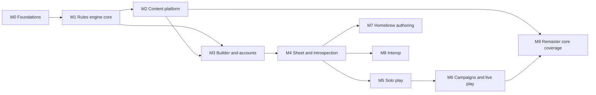

# Roadmap

Mechanics first, breadth later. Every milestone uses Player Core as its dataset; more books arrive in M9.
Milestones are GitHub milestones; epics are issues labelled `type:epic` with their stories as sub-issues.

M1 and M2 overlap: once the M1 schemas land, the importer can be built against them while the engine grows.
M7 and M8 can run in parallel with M5 and M6 if there is capacity.

## M0 Foundations

Exit: architecture and ADRs merged and accepted; labels, milestones, epics and board exist.

- **Architecture and ADRs** (this PR).
- **GitHub project setup**: labels, milestones, project board, issue templates (epic, story, bug, content error).
- **Licensing update**: NOTICE.md reflects stored ORC rules text and the Foundry pf2e data source.

## M1 Rules engine core

Exit: a hand-written level 1 Fighter fixture derives AC, saves, Perception, skills and Strikes with full
breakdowns; stacking and Kleene property tests pass; switching on a Proficiency Without Level variant pack changes
the numbers correctly with no engine change.

- **Rule element, selector and predicate schemas** (`rules/sdk`): discriminated union of rule elements, predicate
  JSON schema, selectors and domains, origin and source ref types.
- **Formula language**: parser to AST, interpreter, references (`@level`, `@attr.dex`, `@prof.armor`), errors
  with positions.
- **Statistic engine**: statistic definitions as content, dependency graph, base terms, modifier collection by
  selector and domain, PF2e stacking with suppressed lines, set and adjust overrides.
- **Grant resolution**: `GrantItem`, `ChoiceSet`, effective item set, origin chains, cycle detection, open
  choice slots.
- **Three-valued predicates**: Kleene evaluator, namespace classification table, conditional lines with generated
  summaries.
- **Core rules pack** (hand-authored, not imported): statistic definitions, skills, attributes, proficiency,
  domains, roll option namespaces, variant rule hooks.
- **Engine test harness**: fixture builders, property tests, performance benchmark (level 20 under 10 ms).

## M2 Content platform

Exit: Player Core imported; every entry validates and has at least one source; at least 90% of entries have all
rule elements translated; public content browser live.

- **Content schemas**: envelope plus per-kind schemas for every kind in content-model.md; rich text AST.
- **Books and sources**: book registry, `SourceRef` validation, source line component.
- **Content storage**: tables, migrations, deploy-time seeding, registry loading from the database,
  content-hashed per-kind bundles for the browser with IndexedDB caching. Retire `libs/content/*`.
- **Foundry importer**: pinned checkout, selection, schema translation, i18n label resolution, HTML and enricher
  conversion, validation, coverage report as a CI artefact.
- **Rule element translators**: one story per Foundry rule element group; untranslatable report.
- **Source enrichment**: spike on obtaining AoN page and URL data within their terms; mapping files; matcher;
  coverage of pages and URLs.
- **Content browser** (public, no account): search, filters (kind, level, traits, rarity, book), entry view with
  rich text, live references and source line.

## M3 Character builder and accounts

Exit: every Player Core class can be built from level 1 to 20 by a signed-in user; Player Core iconic pregens
match their published level 1 statistics.

- **Identity**: OAuth library spike, Discord, Google and GitHub sign-in, sessions, users table, ownership on
  characters, authorisation policies.
- **Character document**: migrate the current `characters` table to the document model, command endpoints,
  schema versioning.
- **Builder flow**: ancestry, heritage, background, class, boosts and flaws, skills, feat slots with prerequisite
  filtering, level-up and level-down, invalid-choice flags.
- **Inventory**: add from content, wield, wear, invest, containers, Bulk, runes, coins, starting kits.
- **Spellcasting build**: prepared, spontaneous and focus casters, repertoires, slots per level, signature spells.

## M4 Sheet and introspection

Exit: every number on the sheet opens a breakdown that explains it; conditional adjustments are visible; feats
can be filtered to what matters.

- **Sheet layout**: text-only sheet sections built from frontier components; keyboard navigation.
- **Breakdown inspector**: applied, suppressed, conditional and overridden lines; origin chains; sources.
- **Conditional adjustments**: shown beside each statistic and on skill and action rows.
- **Feats and features view**: display categories, hide grant-only, fold granted items under their origin.
- **Overrides and custom effects**: create, edit, remove; markers on overridden statistics.
- **Strikes and spells**: attack and damage breakdowns, MAP, spell attack and DC, spell lists.

## M5 Solo play

Exit: a full combat turn can be played from the sheet: choose actions, roll with situational toggles, take damage,
gain and lose conditions, end the turn with correct bookkeeping.

- **Dice library**: expressions, typed damage, fortune and misfortune, degree of success, critical hits, IWR.
- **Roll experience**: roll from any statistic, action or inline text; conditional toggles; roll history.
- **Play state**: HP, temporary HP, dying, wounded, doomed, hero points, focus points, slots, item uses, rest.
- **Conditions and effects**: apply and remove, values, implied conditions, durations, end-of-turn bookkeeping.
- **Action economy**: available actions in the engine; Now and All views; actions remaining and reaction tracker.

## M6 Campaigns and live play

Exit: a GM and four players run a session end to end: party view, shared rolls, encounter with initiative, and a
complete combat log.

- **Campaign management**: create, invite links, roles, enabled packs and variant rules, visibility settings.
- **Event log and live sync**: events table, command handlers, projections, WebSocket hub, LISTEN/NOTIFY,
  resume from sequence.
- **Party introspection**: party summary, read-only sheets with breakdowns, visibility rules.
- **Combat log**: rendered event stream, expandable roll breakdowns, filters.
- **Encounter tracker**: initiative from sheets, ad hoc and Monster Core creatures, rounds, turns, delay, ready.
- **GM tools**: apply damage, conditions, effects and overrides to party members; secret rolls; server dice.

## M7 Homebrew authoring

Exit: a homebrew class with its feats is authored entirely in the app, enabled in a campaign and played.

- **Pack management**: create, visibility, dependencies, enable per campaign or character.
- **Entry editor**: every content kind, rich text, sources with author attribution.
- **Rule element editor**: form per element, predicate builder, formula editor, live preview against a character.
- **Fork and supersede**: copy an official entry into a pack and house-rule it.
- **Variant rules**: GM Core variants (Proficiency Without Level, Automatic Bonus Progression, Free Archetype, Dual
  Class) as packs, toggled per campaign.

## M8 Interop

Exit: pregens export to Foundry and import cleanly; Pathbuilder exports import with a discrepancy report.

- **Pathbuilder import**: name mapping, slot filling, unmatched report, numeric comparison.
- **Pioneer JSON**: export and import with embedded homebrew.
- **Foundry export**: actor JSON, compendium links, choice flags, reverse rule element translation, checklist.

## M9 Remaster core coverage

Exit: Player Core, Player Core 2, GM Core and Monster Core imported to the coverage targets; sources enriched.

- **Player Core 2** import.
- **GM Core** import (items, variant rules, rules elements needed by them).
- **Monster Core** import (creatures for the encounter tracker).
- **Translator gap closing**: work through the untranslatable report.
- **Source enrichment completion**: page numbers and AoN URLs for all imported entries.

## Open questions and risks

| Item                                                                         | Plan                                                                                          |
| ---------------------------------------------------------------------------- | --------------------------------------------------------------------------------------------- |
| How to obtain AoN page numbers and URLs within AoN's terms                   | Spike in M2; ask AoN if needed                                                                |
| OAuth-required builder vs Community Use Policy "no sign-up gate"             | Public content browser; revisit in M3 ([ADR-0007](adr/0007-oauth-required-public-content.md)) |
| Foundry data model changes between releases                                  | Pin release; upgrade as a deliberate PR with coverage diff                                    |
| Rule elements with no clean typed equivalent (path-based `ActiveEffectLike`) | Per-path translators; report the rest                                                         |
| Browser bundle size once spells and equipment load                           | Per-kind lazy bundles; measure in M2                                                          |
| OAuth library for Elysia                                                     | Spike in M3                                                                                   |

## GitHub project management

Issue types are organisation-only, so this personal repository uses labels for type.

- **Labels**
  - Type: `type:epic`, `type:story`, `type:bug`, `type:spike`, `type:content` (data error), `type:chore`.
  - Area: `area:engine`, `area:content`, `area:importer`, `area:builder`, `area:sheet`, `area:play`,
    `area:campaign`, `area:homebrew`, `area:interop`, `area:identity`, `area:ui`, `area:infra`.
  - Priority: `p0`, `p1`, `p2`.
- **Milestones**: M0 to M9 as above, with the exit criteria in the description. No due dates until velocity is
  known.
- **Epics**: one issue per epic bullet, in its milestone, with stories as sub-issues. Epic bodies hold scope,
  out-of-scope and acceptance criteria.
- **Project board** (user-level GitHub Project "Pioneer"):
  - Fields: Status (Backlog, Ready, In progress, In review, Done), Priority, Size (XS to XL), Area.
  - Views: Board by Status; Roadmap by Milestone; Epics table with sub-issue progress; Current milestone.
  - Built-in workflows: new items to Backlog, linked PR opened to In review, merged or closed to Done.
- **Issue templates**: epic, story, bug, content error (entry id, expected vs actual, source page).
